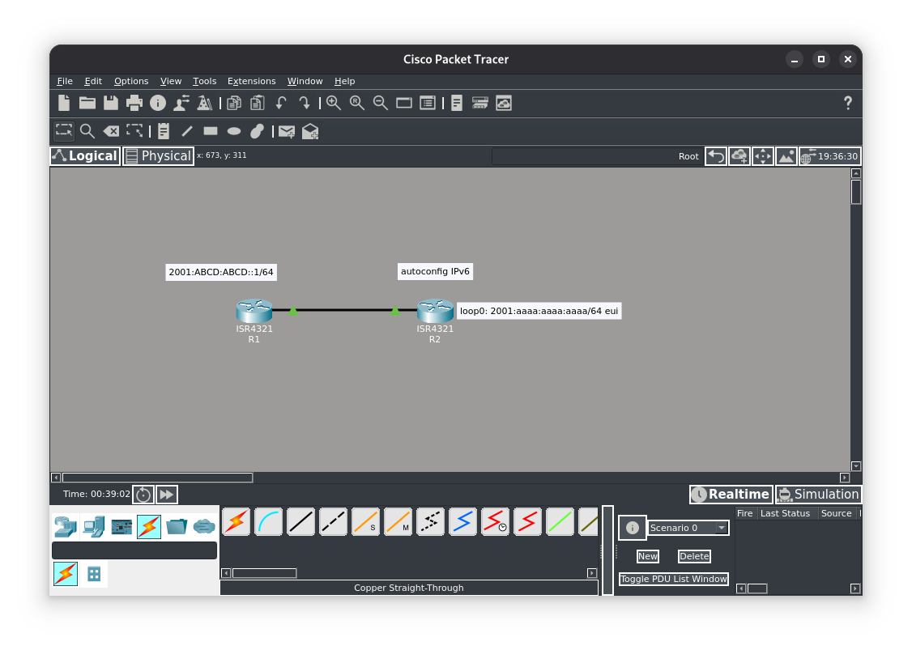
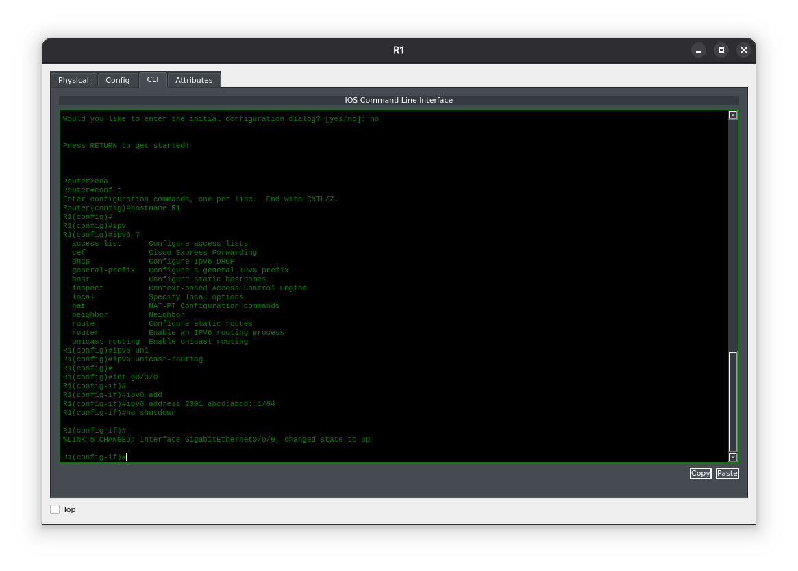
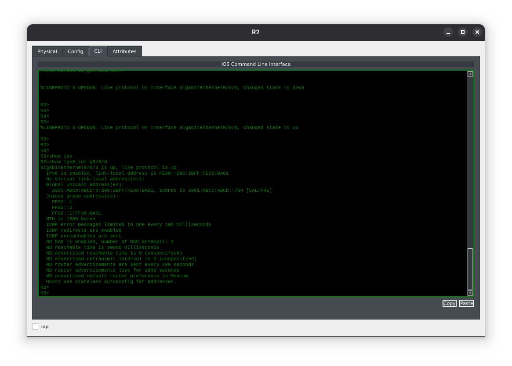
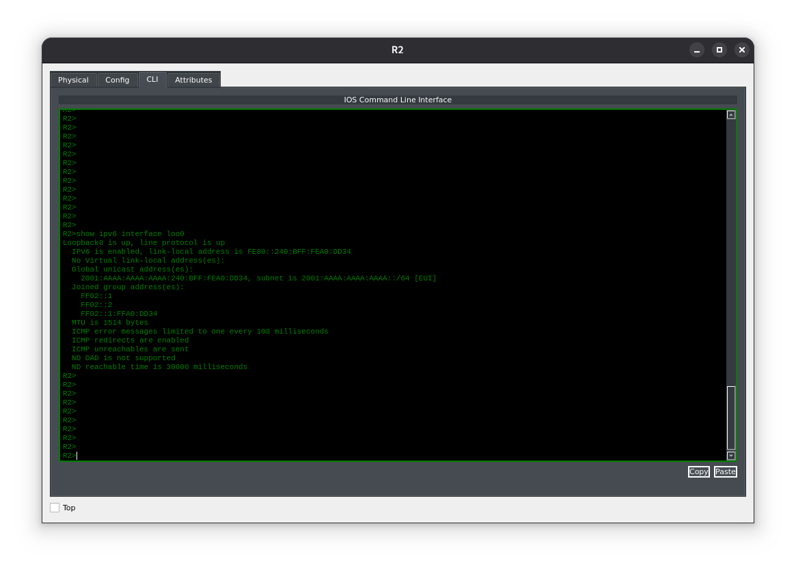
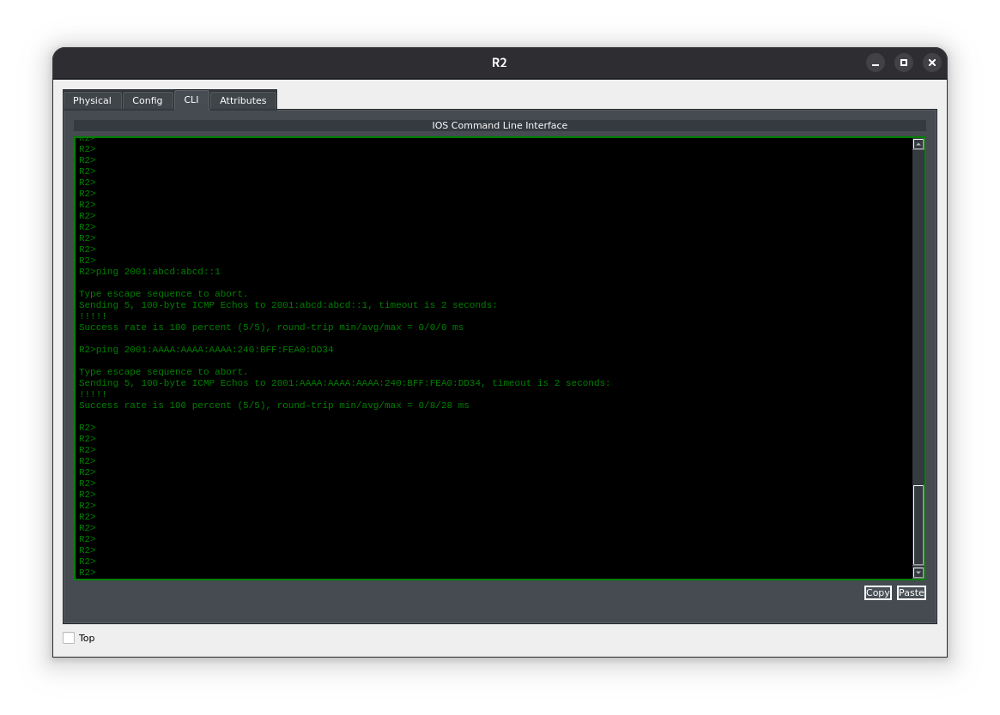

**Цель лабораторной работы:**
Цель этого лабораторного упражнения — научиться и понять, как настраивать IPv6‑адреса на маршрутизаторах Cisco с использованием автоконфигурации адресов и адресации по схеме EUI‑64.

**Топология лабораторной работы:**


---
**Задание 1:**
Настройте имена хостов на маршрутизаторах R1 и R2 в соответствии с приведённой топологией.

**Задание 2:**
Настройте IP‑адреса на Ethernet‑интерфейсах маршрутизаторов R1 и R2 в соответствии с приведённой топологией. Настройте петлевые (Loopback) интерфейсы, указанные на схеме для маршрутизатора R2.

Интерфейс F0/0 на маршрутизаторе R2 будет использовать SLAAC для получения префикса адреса от маршрутизатора R1. Интерфейс Loopback0 будет использовать схему EUI‑64 для формирования хостовой части адреса.

**Задание 3:**
С помощью соответствующих команд `show` проверить:
- сводную информацию обо всех настроенных IP‑адресах;
- состояние интерфейса (up/down или administratively down);
- маску подсети, применённую к интерфейсу.

#### Задание 1:
Зададим имена маршрутизаторов
```
Router#conf t 
Enter configuration commands, one per line.  End with CTRL/Z. 
Router(config)#hostname R1 
R1(config)# 

Router#conf t 
Enter configuration commands, one per line.  End with CTRL/Z. 
Router(config)#hostname R2 
R2(config)#
```

#### Задание 2:
В соответствии с сетевой топологией и заданием настроим IP‑адреса на Ethernet‑интерфейсах маршрутизаторов R1 и R2.
```
R1(config)#ipv6 unicast-routing 
R1(config)#interface f0/0 
R1(config-if)#ipv6 add 2001:abcd:abcd::1/64 
R1(config-if)#no shut 

R2(config)#ipv6 unicast-routing 
R2(config)#interface f0/0 
R2(config-if)#ipv6 add autoconfig 
R2(config-if)#no shut 
R2(config)#interface lo0 
R2(config-if)# ipv6 address 2001:aaaa:aaaa:aaaa::/64 eui-64
```
Ниже видим пример настройки ipv6 адреса на маршрутизаторе Cisco.
Проведение ручной настройки IPv6 адреса на маршрутизаторе R1, он (этот адрес) будет источником для автоматической настройки IPv6 на маршрутизаторе R2.

Настройка IPv6 на интерфейсе loopback0

Проверка соединения
