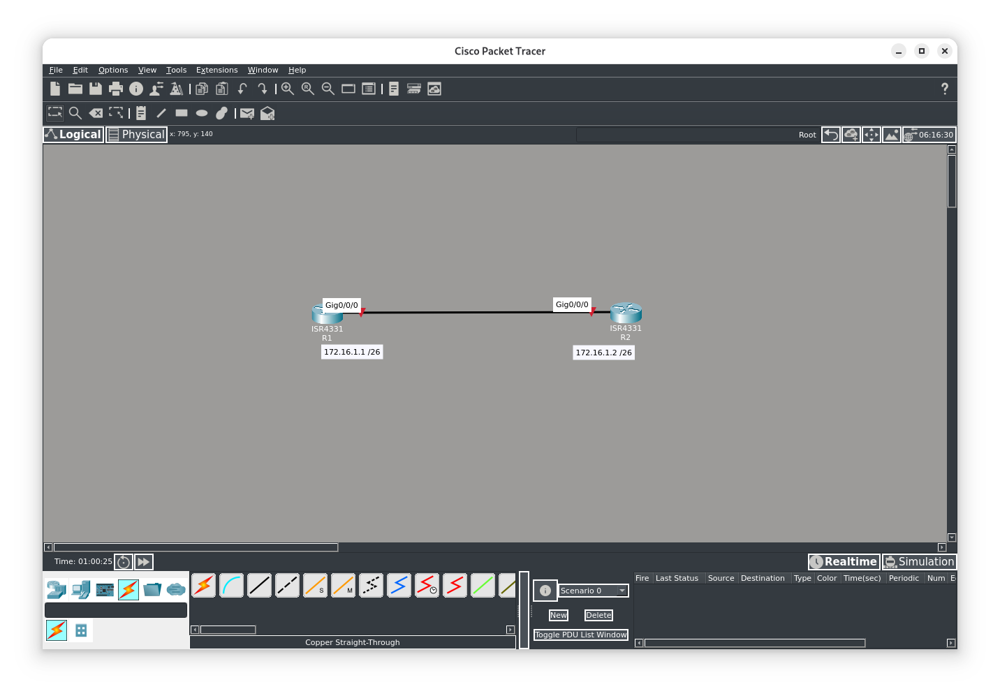
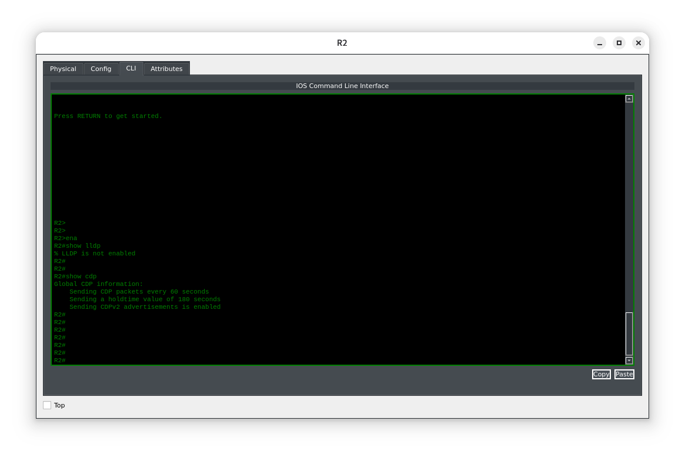
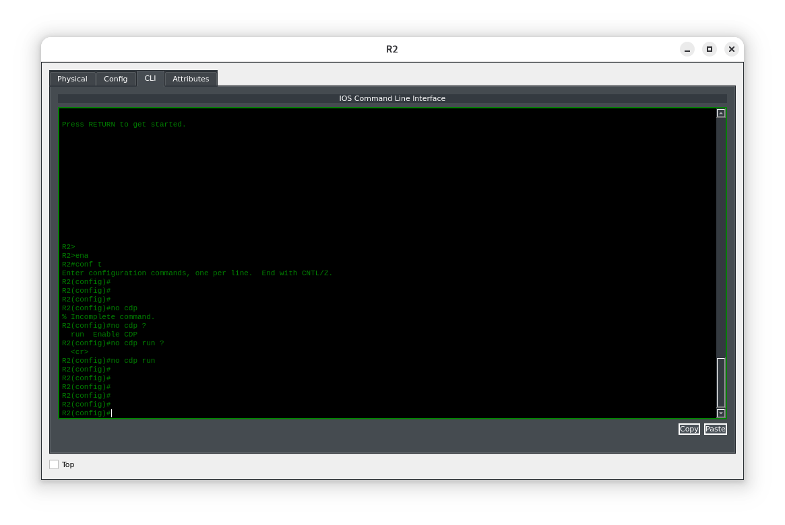
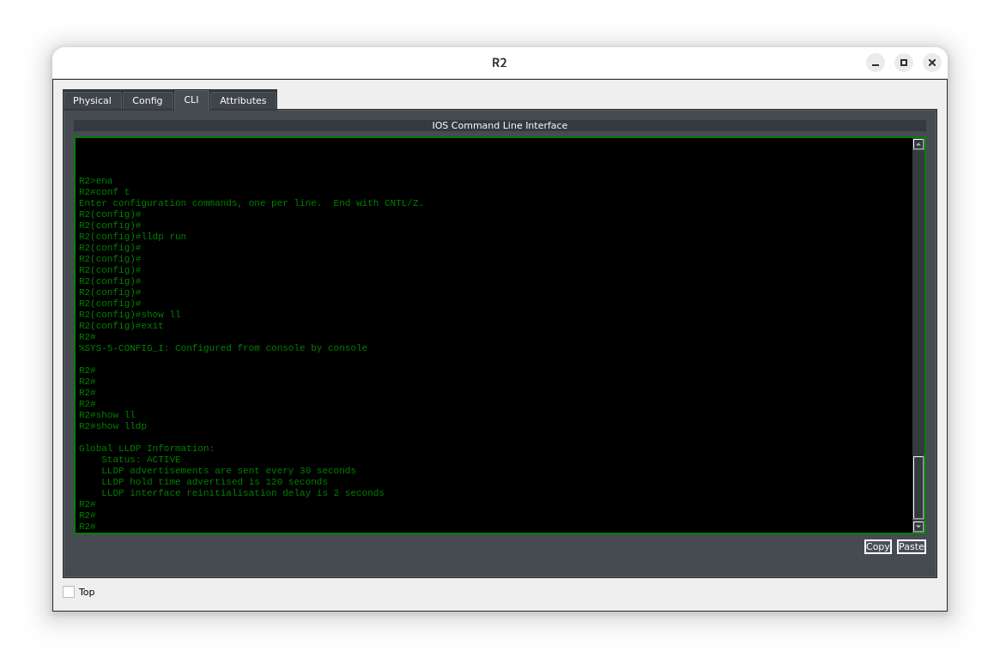
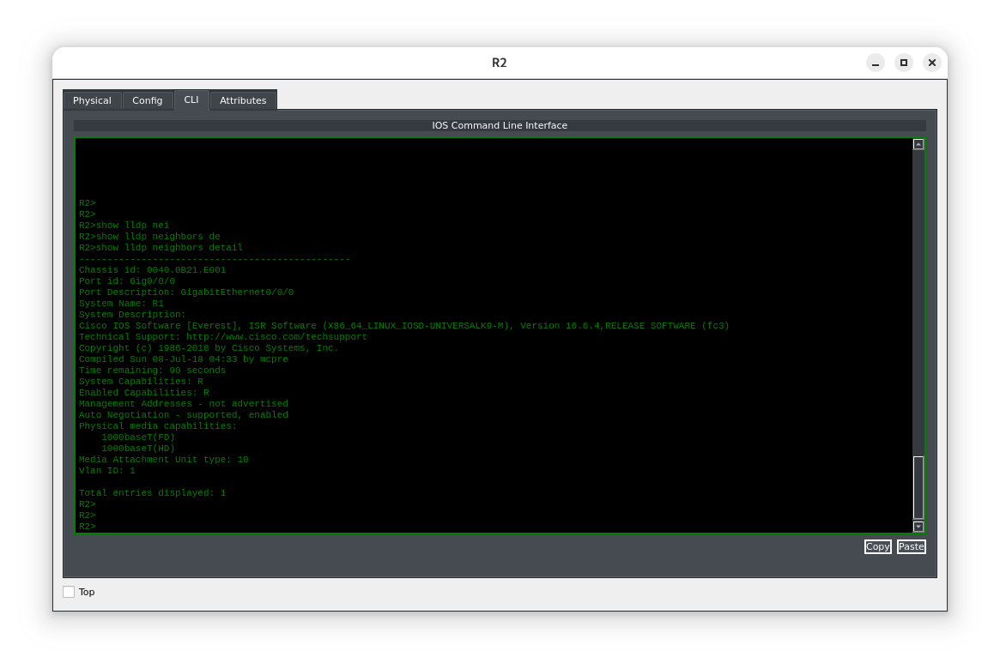

**Цель лабораторной работы:**  
Цель этого лабораторного задания — научиться и разобраться, как включить протокол LLDP в сети Cisco.

Настройка и применение протокола обнаружения устройств канального уровня (LLDP) позволяет сетевым устройствам обнаруживать другие сетевые устройства, напрямую подключённые к ним. Он даёт те же преимущества, что и CDP, но при этом совместим с оборудованием сторонних производителей.

**Задание 1:**  
Настройте имена хостов на маршрутизаторах R1 и R3 в соответствии с топологией.

**Задание 2:**  
Настройте IP‑адреса на Ethernet‑интерфейсах маршрутизаторов R1 и R3 согласно топологии. Настраивать петлевые (Loopback) интерфейсы в этой лабораторной работе не требуется.

**Задание 3:**  
Отключите CDP глобально на обоих маршрутизаторах и включите LLDP (по умолчанию он отключён).

**Задание 4:**  
Убедитесь, что маршрутизаторы R1 и R3 обнаружили друг друга через Ethernet‑соединения с помощью LLDP.

#### Топология


---
#### Задание 1:

#### Задание 2:

#### Задание 3:
Проверим наличие работы протокола LLDP.
```
R2>show lldp
```

Как видно из вывода информации по умолчанию работает только проприетарный протокол Cisco CDP. Выключим его и настроим LLDP: Более универсальный протокол.
```
R1#config t
Enter configuration commands, one per line.
R1(config)#no cdp run
R1(config)#lldp run
R1(config)#end
R1#
R2#conf t
Enter configuration commands, one per line.
R2(config)#no cdp run
R2(config)#lldp run
R2(config)#end
R2#
```


#### Задание 4:
Просмотрим соседние устройства полученные с помощью протокола LLDP
```
R1#show lldp neighbors
```

Далее можно просмотреть интересующую нас информацию об устройстве.