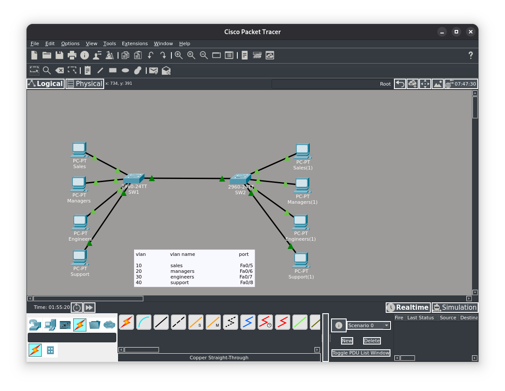
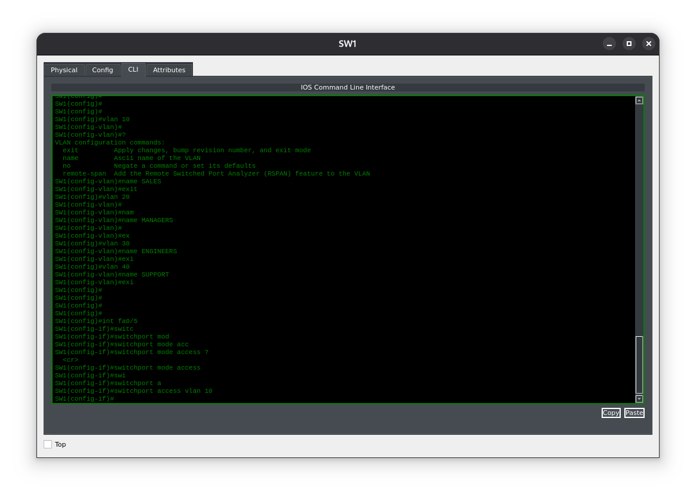
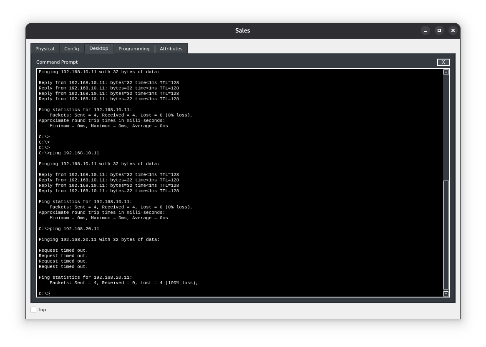

**Цель лабораторной работы:**
Цель этого лабораторного упражнения — научиться и понять, как настраивать стандартные VLANы с 1 по 1001 на коммутаторах Cisco Catalyst под управлением IOS.

**Назначение лабораторной работы:**
Настройка VLAN — базовый навык сетевого инженера. VLAN позволяют сегментировать сеть на несколько меньших широковещательных доменов. 

### Топология

---
**Задание 1:**
В рамках подготовки к настройке VLAN задайте имя хоста для коммутатора Sw1, а также настройте VLAN, указанные в топологии.

**Задание 2:**
Настройте порты FastEthernet0/5–FastEthernet0/8 как порты доступа (access‑порты) и назначьте их указанным VLAN.

**Задание 3:**
Проверьте конфигурацию VLAN с помощью соответствующих команд `show` в Cisco IOS.

#### Задание 1:
Переименуем коммутаторы и распределим VLANы согласно топологии.
```
Switch#config t 
Enter configuration commands, one per line.  End with CTRL/Z. 
Switch(config)#hostname SW1 
SW1(config)#vlan10 
SW1(config-vlan)#name SALES 
SW1(config-vlan)#exit 
SW1(config)#vlan20 
SW1(config-vlan)#name MANAGERS 
SW1(config-vlan)#exit 
SW1(config)#vlan30 
SW1(config-vlan)#name ENGINEERS 
SW1(config-vlan)#exit 
SW1(config)#vlan40 
SW1(config-vlan)#name SUPPORT
```
Пример конфигурации:

#### Задание 2:
За каждым портом закрепим определенный VLAN, за исключением порта GigabitEthernet0/1, его определим как транковый для передачи пакетов нескольких VLANов между коммутаторами SW1 и SW2. 
```
SW1(config)#interface fastethernet0/5 
SW1(config-if)#switchport mode access 
SW1(config-if)#switchport access vlan10 
SW1(config-if)#exit 
SW1(config)#interface fastethernet0/6 
SW1(config-if)#switchport mode access 
SW1(config-if)#switchport access vlan20 
SW1(config-if)#exit 
SW1(config)#interface fastethernet0/7 
SW1(config-if)#switchport mode access 
SW1(config-if)#switchport access vlan30 
SW1(config-if)#exit 
SW1(config)#interface fastethernet0/8 
SW1(config-if)#switchport mode access 
SW1(config-if)#switchport access vlan40
```

#### Проверка

В данном случае номер влана соответствует третьему октету адреса устройства, поэтому мы видим, что проходит ping от 192.168.10.10 к 192.168.10.11. Другие сети изолированы и представляют собой отдельный широковещательный домен.  