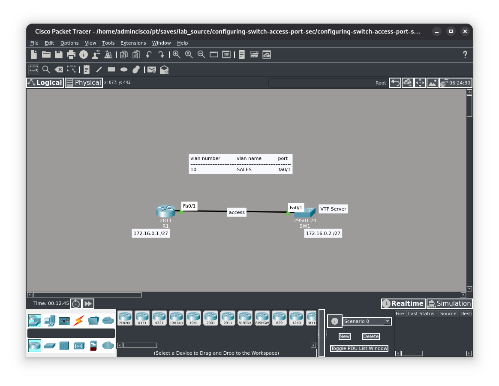
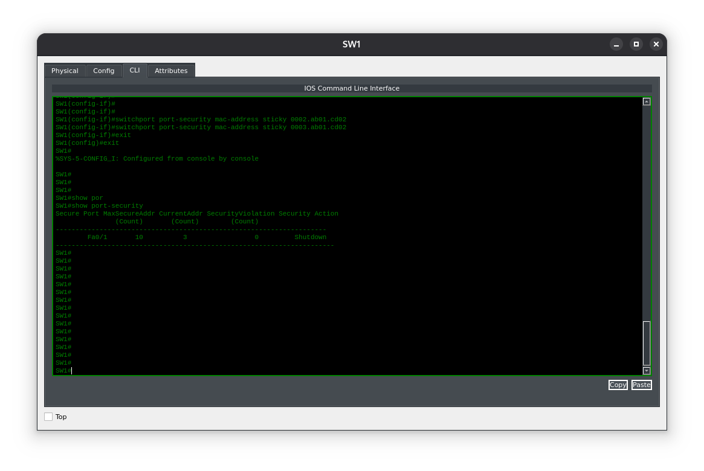
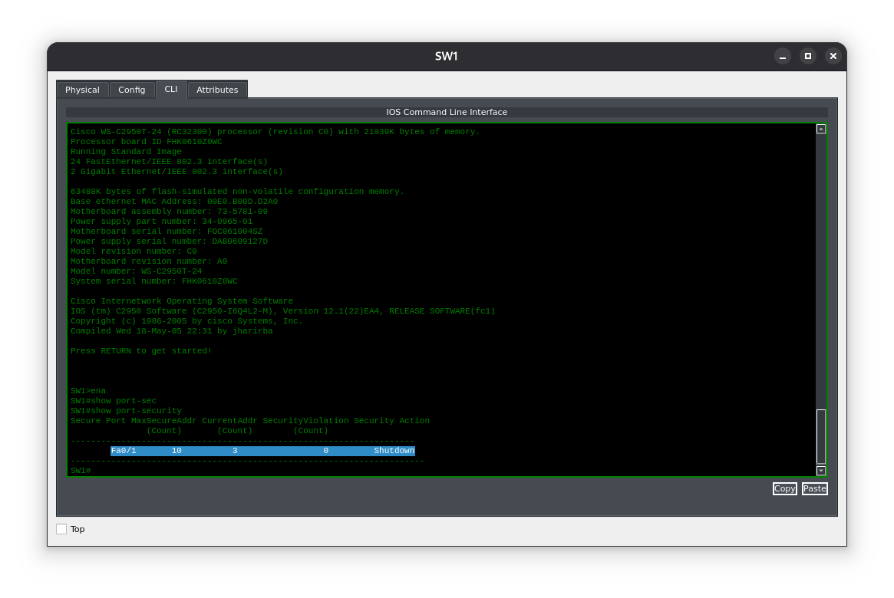
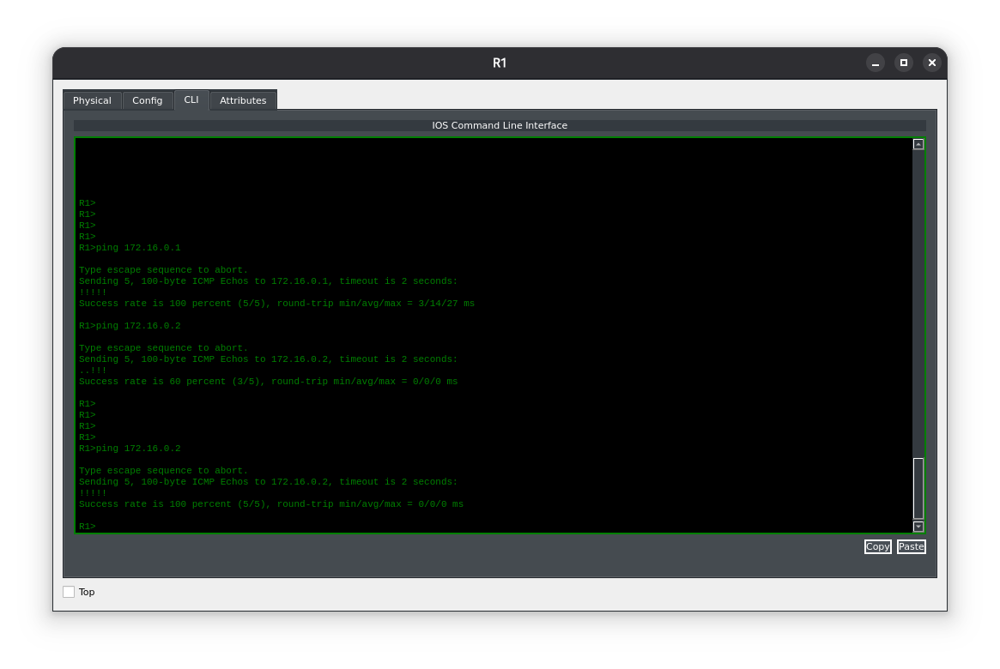

**Цель лабораторной работы:**
Цель этого лабораторного упражнения — обеспечить сохранение изученных MAC‑адресов на защищённом порту в NVRAM коммутатора при перезагрузке. По умолчанию когда коммутатор Cisco Catalyst с настроенной защитой портов (port security) перезагружается, записи о защищённых MAC‑адресах удаляются, и их приходится изучать заново после восстановления работы коммутатора.

**Задание 1:**
Настройте имена хостов для коммутатора SW1 и маршрутизатора R1 в соответствии с приведённой топологией.

**Задание 2:**
Создайте VLAN 10 на коммутаторе SW1 и назначьте порт FastEthernet0/1 в этот VLAN в качестве порта доступа (access port).

**Задание 3:**
Настройте IP‑адрес 172.16.0.1/27 на интерфейсе FastEthernet0/1 маршрутизатора R1 и IP‑адрес 172.16.0.2/27 на интерфейсе VLAN10 коммутатора SW1. Проверьте, что R1 может выполнить ping до SW1, и наоборот.

**Задание 4:**
Настройте защиту порта (port security) на порту FastEthernet0/1 коммутатора SW1 так, чтобы все MAC‑адреса, изученные на этом интерфейсе, записывались в NVRAM коммутатора. NVRAM — это память, где хранится стартовая конфигурация (startup configuration). Проверьте конфигурацию с помощью команд port security в Cisco IOS.

---

#### Топология


---

#### Задание 1:
Пример настройки имени хостов, можно просмотреть в предыдущих лабораторных решениях.
#### Задание 2:
Создание и определение VLANов проводилось в соответствии с заданием, пример настройки VLANов можно осмотреть в одной из первых лабораторных работах.

#### Задание 3:
Настройка IP адресов производилась в соответствии с заданием. Пример выполнения можно просмотреть здесь [[Configuring Switch Access Port Security]]

#### Задание 4:
Для сохранения в памяти ранее изученных MAC адресов проведем следующую конфигурацию
```
SW1>ena
SW1#conf t
Enter configuration commands, one per line. End with CNTL/Z.
SW1(config)#int fa0/1
SW1(config-if)#switchport port-security mac-address sticky
SW1#conf t
Enter configuration commands, one per line. End with CNTL/Z.
SW1(config)#int fa0/1
SW1(config-if)#switchport port-security mac-address sticky 0002.ab01.cd02
Total secure mac-addresses on interface FastEthernet0/1 has reached maximum limit.

!! Мы взяли топологию с конфигами из прошлой лабораторной, где задавали максимальный лимит MAC адресов. Что мы здесь и видим: у нас есть один изученный адрес и при попытке добавить новый, натыкаемся на проблемку. Для ее решения переконфигурируем на максимальное количество MAC-ов равное 10 !!

SW1(config-if)#switchport port-security maximum 10
SW1(config-if)#switchport port-security mac-address sticky 0002.ab01.cd02
SW1(config-if)#switchport port-security mac-address sticky 0003.ab01.cd02
SW1(config-if)#exit
SW1(config)#exit
%SYS-5-CONFIG_I: Configured from console by console
%SYS-5-CONFIG_I: Configured from console by console
SW1#copy run start
Destination filename startup-config?
Building configuration...
```

Как видим при проверке у нас сохранились три MAC адреса в памяти. Пробуем перезагрузится.

После перезагрузки у нас так и остались лежать в памяти ранее изученные MAC адреса. Проверим доступность соединения.
