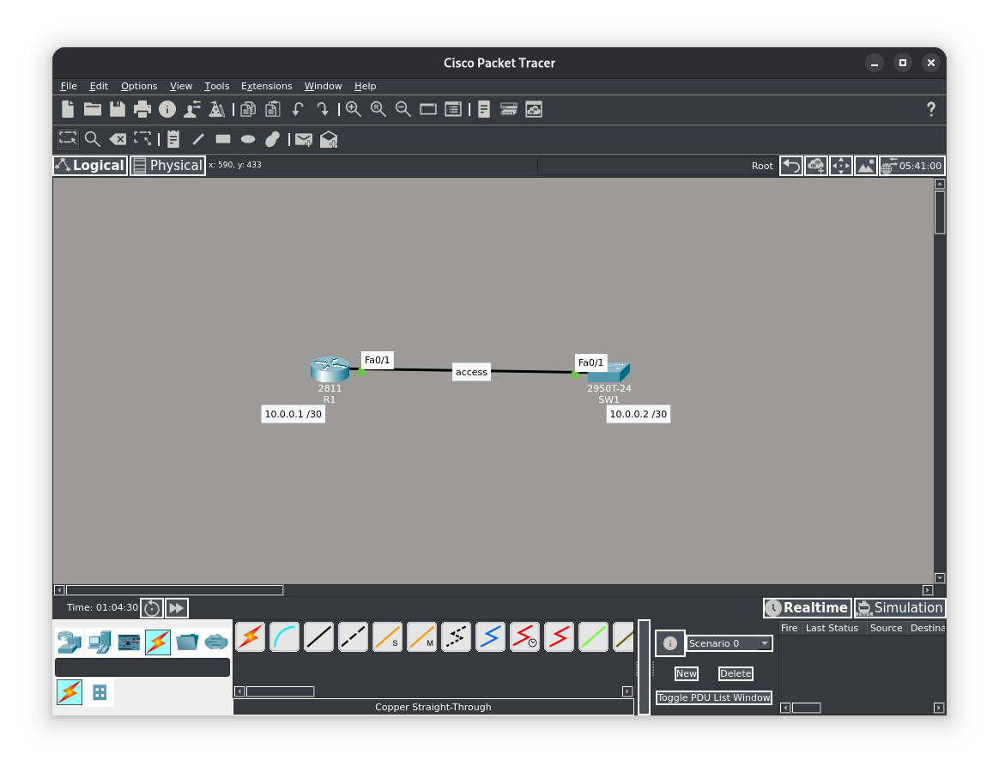
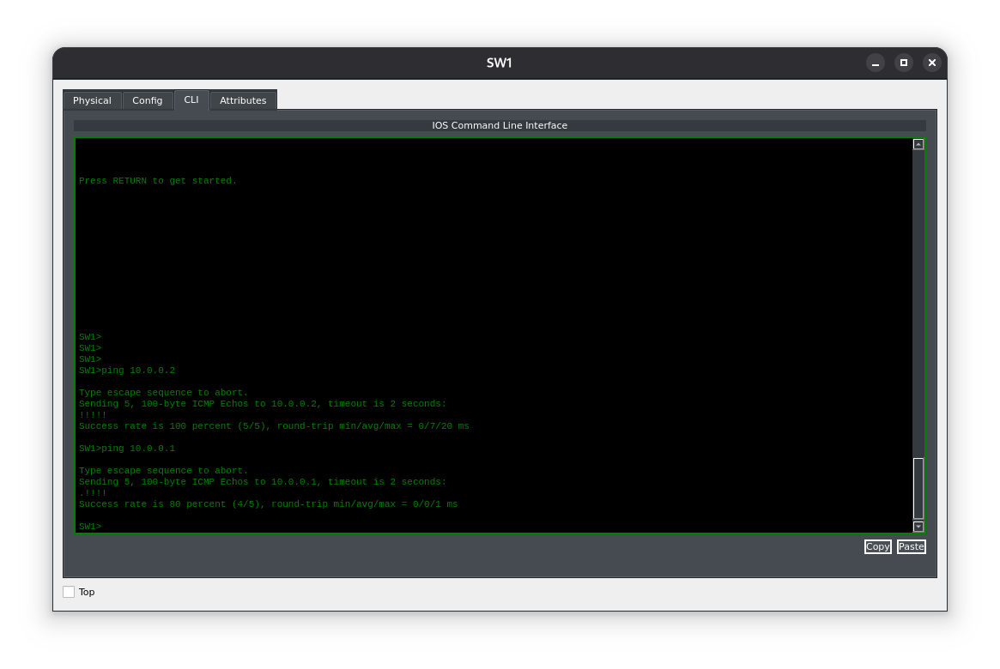
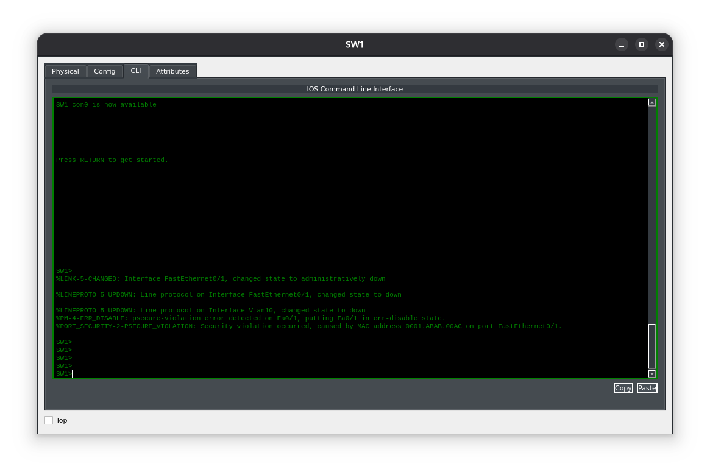

**Цель лабораторной работы:**
Цель этого лабораторного упражнения — настроить базовую защиту коммутатора, чтобы предотвратить затопление MAC‑адресами (MAC flooding) на портах коммутатора. Это достигается путём ограничения количества MAC‑записей, которые могут быть изучены на порту. По умолчанию ограничение на количество MAC‑адресов, которые могут быть изучены на порту, отсутствует.

**Назначение лабораторной работы:**
Настройка защиты портов (port security). Распространённый метод атаки типа «отказ в обслуживании» (DoS), с помощью которого можно вывести из строя коммутируемые сети, — это затопление MAC‑адресами.

**Задание 1:**
Настройте имена хостов для коммутатора SW1 и маршрутизатора R1 в соответствии с приведённой топологией.

**Задание 2:**
Создайте VLAN 10 на коммутаторе SW1 и назначьте порт FastEthernet0/2 в этот VLAN в качестве порта доступа (access port).

**Задание 3:**
Настройте IP‑адрес 10.0.0.1/30 на интерфейсе FastEthernet0/0 маршрутизатора R1 и IP‑адрес 10.0.0.2/30 на интерфейсе VLAN10 коммутатора SW2. Проверьте, что R1 может выполнить ping до SW1, и наоборот.

**Задание 4:**
Настройте защиту порта (port security) на порту FastEthernet0/1 коммутатора SW1 так, чтобы на этом интерфейсе разрешалось изучение только одного MAC‑адреса. В случае нарушения конфигурации защиты порта (если на интерфейсе будет обнаружено более одного MAC‑адреса) коммутатор должен отключить интерфейс.
#### Топология

---
#### Задание 1:
Настройка именов устройств, выполнялась в соответствии с заданием, пример с настройкой именов можно просмотреть в одной из первых лабораторных работах.
#### Задание 2:
Создание и определение VLANов проводилось в соответствии с заданием, пример настройки VLANов можно осмотреть в одной из первых лабораторных работах.
#### Задание 3:
Настройка адресации устройств в соответствии с заданием. Настройка интерфейса маршрутизатора производилась аналогичным образом.
```
SW1(config)#int vlan 10 
%LINK-5-CHANGED: Interface Vlan10, changed state to up 
SW1(config-if)#ip add 10.0.0.2 255.255.255.252 
SW1(config-if)#no shut 
SW1(config-if)#end 
```

Настроим port security.
```
SW1#conf t 
Enter configuration commands, one per line.  End with CTRL/Z. 
SW1(config)#interface fastethernet 0/2 
SW1(config-if)#switchport port-security 
SW1(config-if)#switchport port-security maximum 1 
SW1(config-if)#switchport port-security violation shutdown 
SW1(config-if)#end
```

#### Задание 4:

```
R1(config)#int fa0/1
R1(config-if)#mac-address 0001.abab.00ac

// Как только поменяли MAC адрес коммутатор сразу же выключил интерфейс, т.к.
// изучил только один MAC адрес.

%LINEPROTO-5-UPDOWN: Line protocol on Interface FastEthernet0/1, changed state to down
```
Проверим коммутатор

***Коммутатор отключил порт и сообщил о неизвестном MAC адресе.***