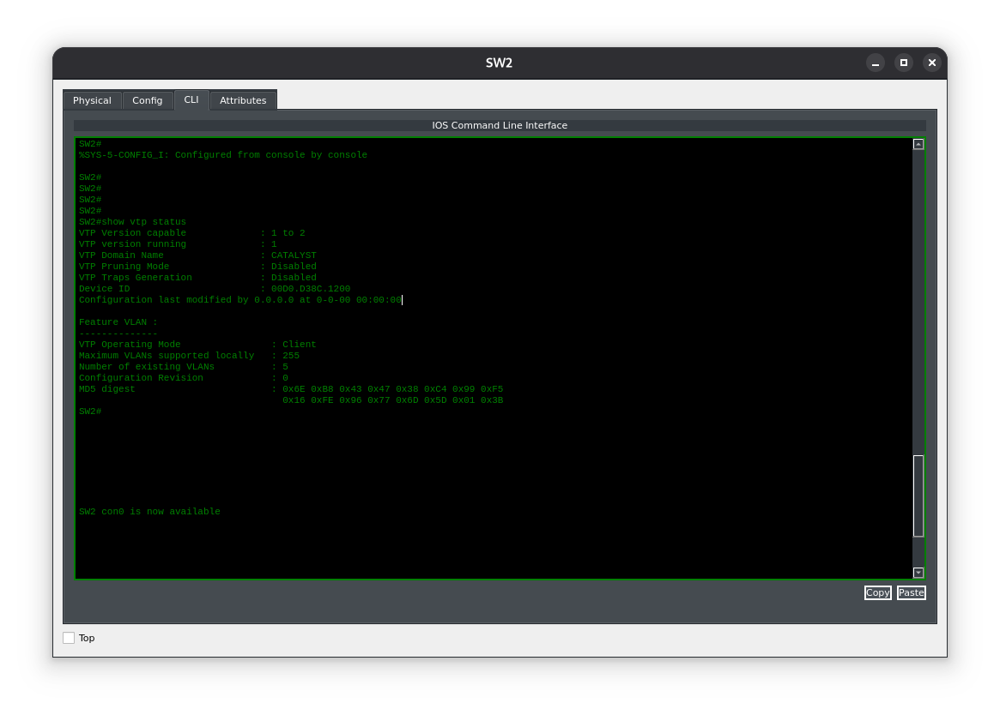
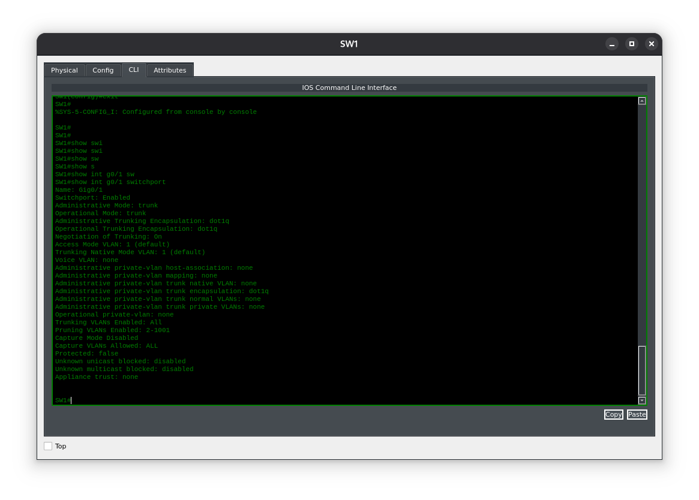
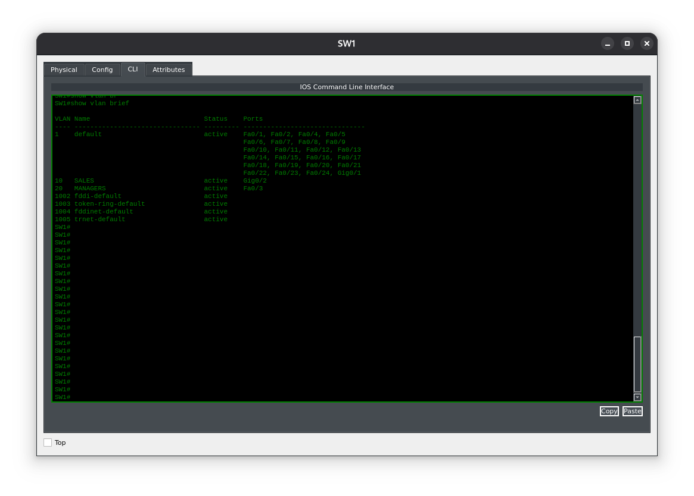
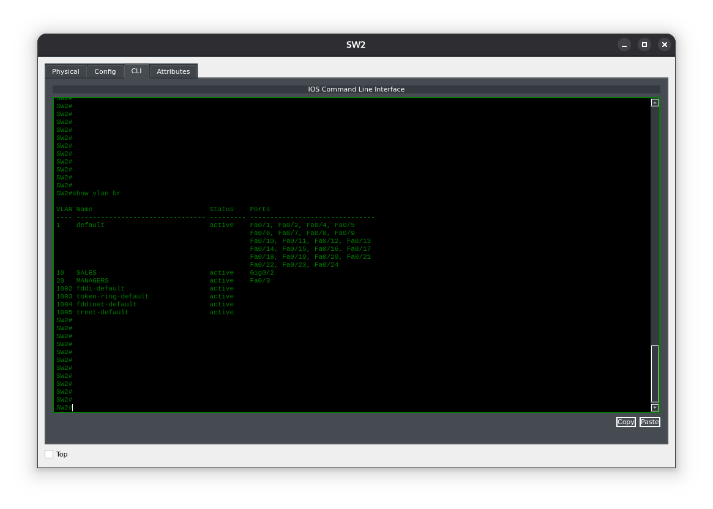
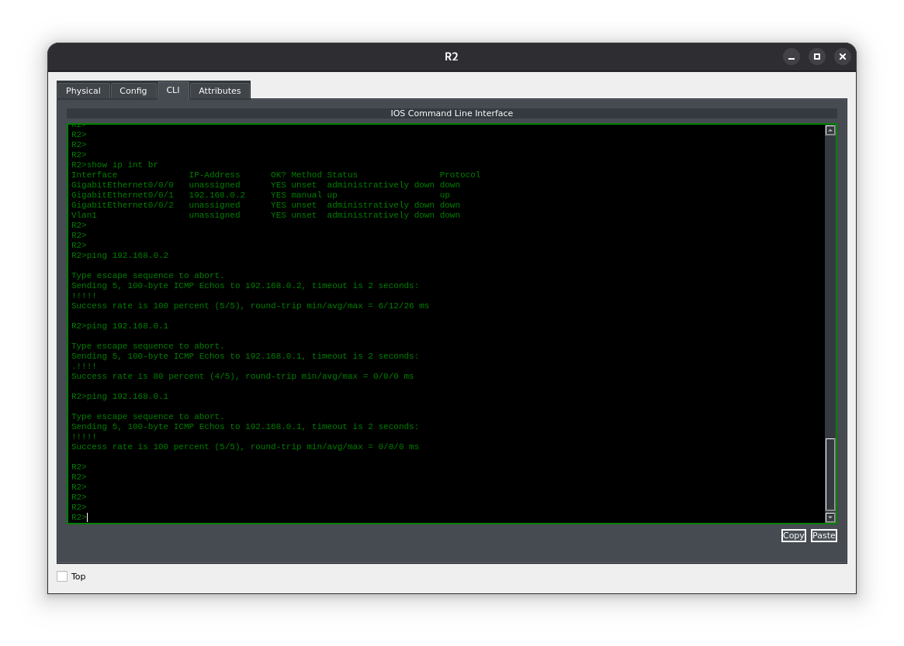

**Цель лабораторной работы:**

Цель этого лабораторного упражнения — научиться и понять, как настраивать режимы VTP‑сервера и VTP‑клиента на коммутаторах Cisco Catalyst. По умолчанию все коммутаторы Cisco работают в режиме VTP‑сервера. VLAN настраиваются на VTP‑серверах, а VTP‑клиенты получают информацию о VLAN от VTP‑серверов в том же домене VTP. Обмен данными о VLAN возможен за счёт использования транкового соединения (trunk) между коммутаторами. 

#### Топология


---

**Задание 1:**

В рамках подготовки к настройке VLAN задайте имена хостов для коммутаторов и маршрутизаторов в соответствии с приведённой топологией. 
**Задание 2:**

Настройте и проверьте, что коммутатор Sw1 работает в режиме VTP‑сервера, а коммутатор Sw2 — в режиме VTP‑клиента. Оба коммутатора должны находиться в домене VTP с именем CATALYST.

**Задание 3:**

Настройте и проверьте транковое соединение (802.1Q trunk) на интерфейсе FastEthernet0/1 между коммутаторами Sw1 и Sw2.

**Задание 4:**

Настройте и проверьте VLAN 10 и VLAN 20 на коммутаторе Sw1 с указанными именами. Назначьте интерфейс FastEthernet0/2 на обоих коммутаторах (Sw1 и Sw2) в VLAN 10. Этот интерфейс должен быть настроен как порт доступа (access port).

**Задание 5:**

Настройте на интерфейсах FastEthernet0/0 маршрутизаторов R1 и R3 IP‑адреса 10.0.0.1/28 и 10.0.0.3/28 соответственно. Проверьте связность через настроенные VLAN, выполнив ping с R3 на R1 и наоборот.


#### Задание 1:
Зададим имена устройств
```
Switch#config t 
Enter configuration commands, one per line.  End with CTRL/Z. 
Switch(config)#hostname Sw1 
Sw1(config)# 

Switch#config t 
Enter configuration commands, one per line.  End with CTRL/Z. 
Switch(config)#hostname Sw2 
Sw1(config)# 

Router#config t 
Enter configuration commands, one per line.  End with CTRL/Z. 
Router(config)#hostname R1 
R1(config)# 

Router#config t 
Enter configuration commands, one per line.  End with CTRL/Z. 
Router(config)#hostname R3 
R3(config)#
```

#### Задание 2:
```
SW1#config t 
Enter configuration commands, one per line.  End with CTRL/Z. 
SW1(config)#vtp domain CATALYST 
Changing VTP domain name from Null to CATALYST 
SW1(config)# 

SW2#config t 
Enter configuration commands, one per line.  End with CTRL/Z. 
SW2(config)#vtp mode client
Setting device to VTP CLIENT mode. 
SW2(config)#vtp domain CATALYST 
Changing VTP domain name from Null to CATALYST 
SW2(config)#end
```
Просмотр стстауса vtp на коммутаторе выполняющего роль клиента vtp

#### Задание 3:
Некоторые коммутаторы Cisco по умолчанию работают в режиме транка 802.1Q — поэтому явная настройка не требуется. Наш так не работает поэтому будем настраивать.
```
SW1#conf t
Enter configuration commands, one per line. End with CNTL/Z.
SW1(config)#int g0/1
SW1(config-if)#switchport mode trunk
SW1(config-if)#
SW1(config-if)#switchport trunk allowed vlan all
```


#### Задание 4:
На коммутаторе SW1 определим VLANы согласно заданию. На коммутаторе задавать ничего не будем, так как SW2 должен запросить с сервера наличие VLANов.

Как мы видим SW2(Клиент) опросил SW1(Сервер) на наличие VLANов, но интерфейсы присвоены не были, будем прописывать.
```
SW2#conf t
Enter configuration commands, one per line. End with CNTL/Z.
SW2(config)#int g0/2
SW2(config-if)#switchport mode access
SW2(config-if)#switchport access vlan 10
SW2(config-if)#exit
SW2(config)#int fa0/3
SW2(config-if)#switchport mode access
SW2(config-if)#switchport access vlan 20
SW2(config-if)#exit
```

#### Задание 5:

```
R1>ena
R1#conf t
Enter configuration commands, one per line. End with CNTL/Z.
R1(config)#int g0/0/1
R1(config-if)#ip add
R1(config-if)#ip address 192.168.0.1 255.255.255.240
R1(config-if)#no shut
%LINK-5-CHANGED: Interface GigabitEthernet0/0/1, changed state to up
%LINEPROTO-5-UPDOWN: Line protocol on Interface GigabitEthernet0/0/1, changed state to up
R1(config-if)#end

R2>ena
R2#conf t
Enter configuration commands, one per line. End with CNTL/Z.
R2(config)#int g0/0/1
R2(config-if)#ip add 192.168.0.2 255.255.255.240
R2(config-if)#exit
R2(config)#exit
```

Соединение установлено!
