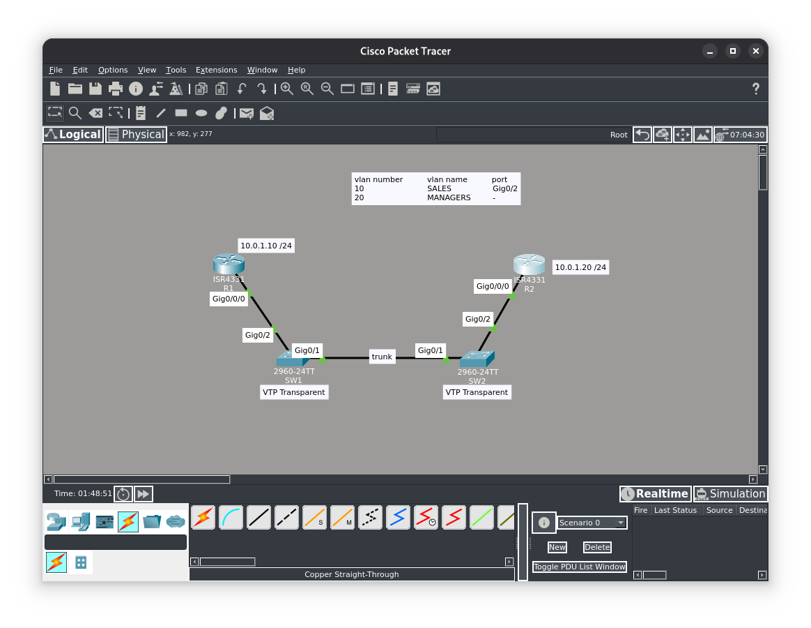
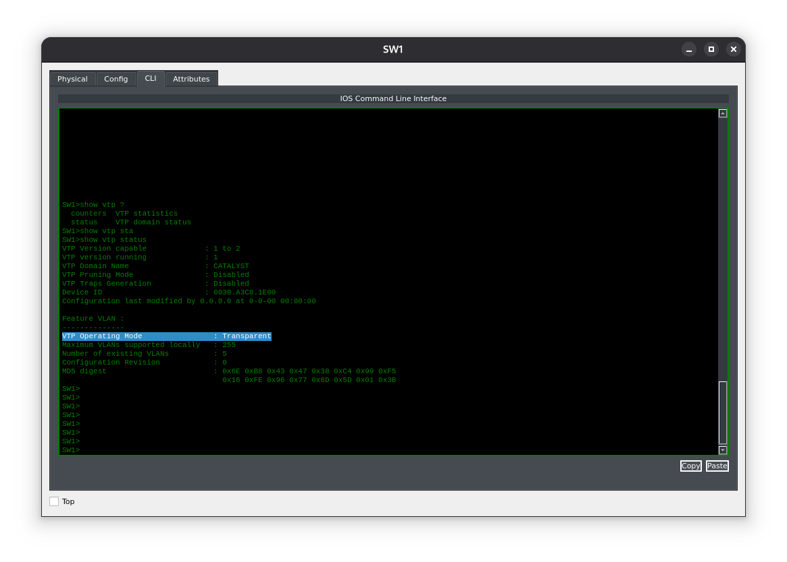
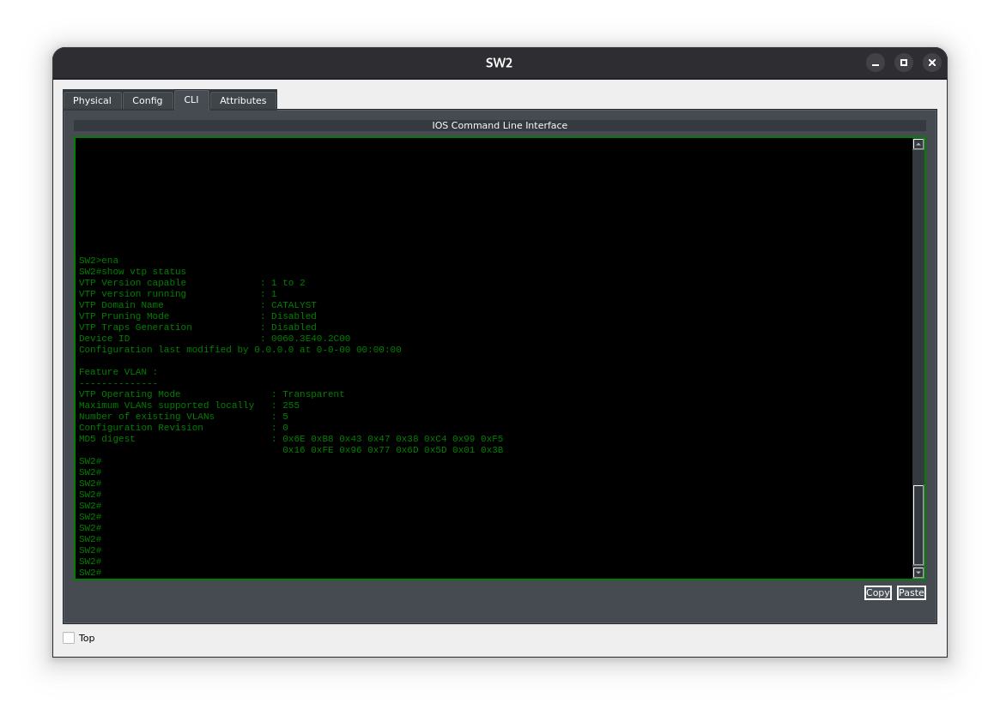
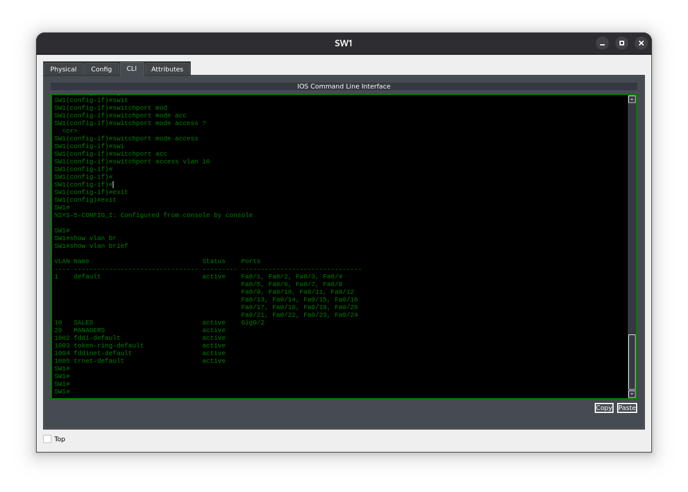
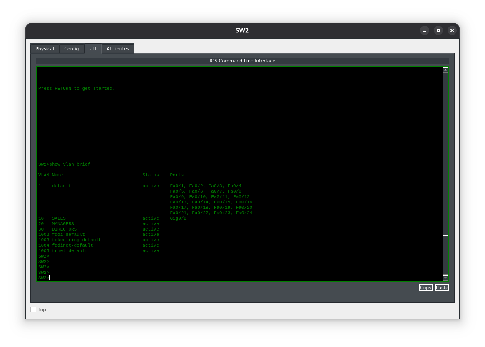
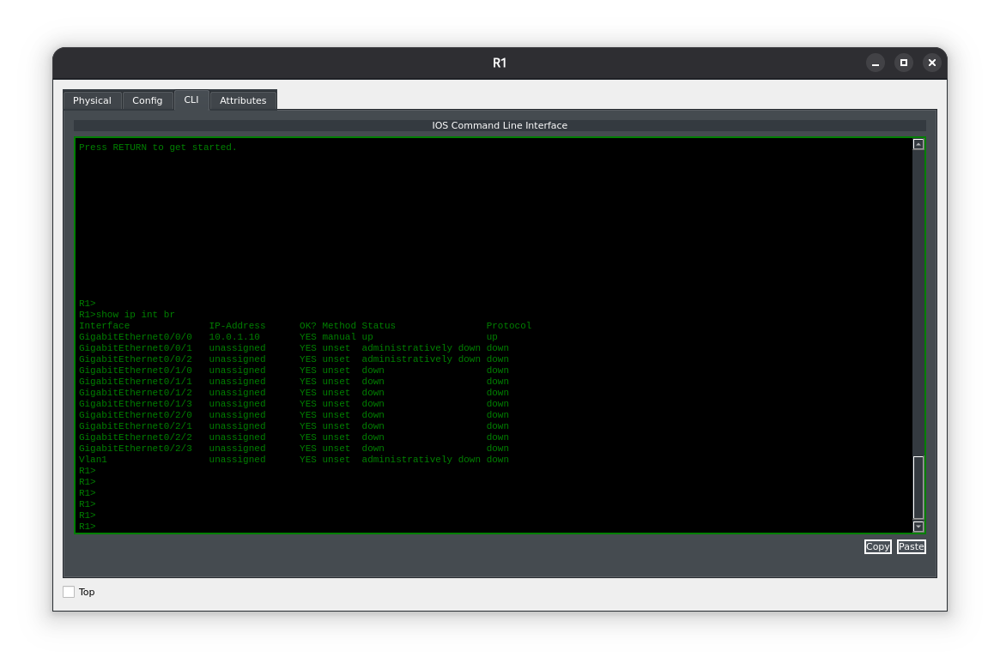
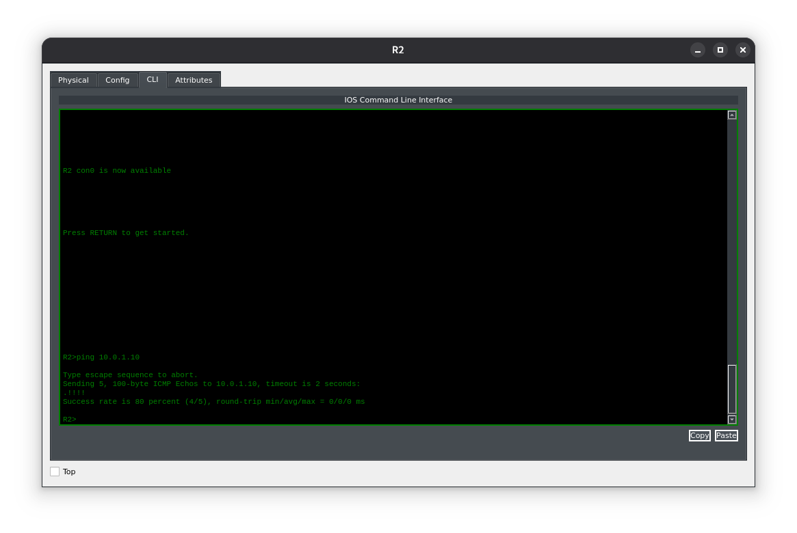

**Цель лабораторной работы:**
Цель этого лабораторного упражнения — научиться и понять, как настраивать режим VTP Transparent на коммутаторах Cisco.

**Назначение лабораторной работы:**
VLAN, настроенные на коммутаторе в режиме VTP Transparent, не распространяются автоматически на другие коммутаторы в том же домене VTP — в отличие от того, как это происходит при использовании VTP‑сервера. Коммутаторы в режиме VTP Transparent используют транковое соединение (trunk), чтобы пересылать трафик для настроенных VLAN на другие коммутаторы.

#### Топология


---

**Задание 1:**
Задайте имена хостов для коммутаторов 1 и 2, а также маршрутизаторов 1 и 2 в соответствии с приведённой топологией.

**Задание 2:**
Настройте и проверьте, что коммутаторы SW1 и SW2 работают в режиме VTP Transparent. Оба коммутатора должны находиться в домене VTP с именем CATALYST. Для обмена информацией о VLAN через транк коммутаторы должны быть в одном домене VTP.

**Задание 3:**
Настройте и проверьте транковое соединение (802.1Q trunk) на интерфейсе GigabitEthernet0/1 между коммутаторами SW1 и SW2.

**Задание 4:**
Настройте и проверьте VLAN 10 и VLAN 20 на коммутаторе SW1 с указанными выше именами. Назначьте интерфейс GigabitEthernet0/2 на SW1 в VLAN 10 в качестве порта доступа (access port). Настройте и проверьте VLAN 20 и VLAN 30 на коммутаторе SW2 с указанными выше именами. Назначьте интерфейс GigabitEthernet0/2 на SW2 в VLAN 10 в качестве порта доступа.

**Задание 5:**
Настройте на интерфейсах GigabiEthernet0/0/0 маршрутизаторов R1 и R2 IP‑адреса 10.0.1.10/24 и 10.0.1.20/24 соответственно. Проверьте связность в рамках VLAN, выполнив ping между R1 и R2.

#### Задание 1:
```
Switch>ena
Switch#conf t
Enter configuration commands, one per line. End with CNTL/Z.
Switch(config)#hostname SW1
```
Настройка остальных устройств для задания 1, производится идентично и не приводится здесь.

#### Задание 2:
Проверка коммутаторов. По умолчанию коммутаторы работаю в режиме Server.

Настроим transparent mode и зададим домен VTP.
```
SW1#conf t
Enter configuration commands, one per line. End with CNTL/Z.
SW1(config)#vtp mode transparent
Setting device to VTP TRANSPARENT mode.
SW1(config)#vtp domain CATALYST
Changing VTP domain name from NULL to CATALYST
%SW_VLAN-6-VTP_DOMAIN_NAME_CHG: VTP domain name changed to CATALYST.
```
Выполним проверку

Устройство работает в режиме transparent, настройка SW2 выполняется идентично: настроаивается тот же домен и режим.

#### Задание 3.
Настроим транковые порты между коммутаторами, разрешив 10 и 20 VLANы.
```
SW1#conf t
Enter configuration commands, one per line. End with CNTL/Z.
SW1(config)#int g0/1
SW1(config-if)#switchport mode trunk
%LINEPROTO-5-UPDOWN: Line protocol on Interface GigabitEthernet0/1, changed state to down
%LINEPROTO-5-UPDOWN: Line protocol on Interface GigabitEthernet0/1, changed state to up
SW1(config-if)#switchport trunk allowed vlan 10,20


SW2#conf t
Enter configuration commands, one per line. End with CNTL/Z.
SW2(config)#int g0/1
SW2(config-if)#switchport mode trunk
%LINEPROTO-5-UPDOWN: Line protocol on Interface GigabitEthernet0/1, changed state to down
%LINEPROTO-5-UPDOWN: Line protocol on Interface GigabitEthernet0/1, changed state to up
SW2(config-if)#switchport trunk allowed vlan 10,20
```
#### Задание 4:
Зададим пользовательские VLANы на SW1 и SW2, в соответствии с заданием.
```
SW1>ena
SW1#conf t
Enter configuration commands, one per line. End with CNTL/Z.
SW1(config)#vlan 10
SW1(config-vlan)#name SALES
SW1(config-vlan)#exit
SW1(config)#vlan 20
SW1(config-vlan)#name MANAGERS
SW1(config-vlan)#exit

SW1(config)#int g0/2
SW1(config-if)#switchport mode access
SW1(config-if)#switchport access vlan 10
SW1(config-if)#exit
```

```
SW2#conf t
Enter configuration commands, one per line. End with CNTL/Z.
SW2(config)#vlan 10
SW2(config-vlan)#name SALES
SW2(config-vlan)#exit
SW2(config)#vlan 20
SW2(config-vlan)#name MANAGERS
SW2(config-vlan)#exit
SW2(config)#vlan 30
SW2(config-vlan)#name DIRECTORS
SW2(config)#int g0/2
SW2(config-if)#switchport mode access
SW2(config-if)#switchport access vlan 10
SW2(config-if)#exit
SW2(config)#

```

Как можно заметить в режиме transparent коммутаторы не обмениваются VLANами, между собой как это происходит в модели Client-Server. Все VLANы настраиваются вручную. Это связано с тем, что иногда на коммутаторе нужны VLAN, специфичные только для этого сегмента (например, гостевой Wi‑Fi, отдельный VLAN для камер, тестовый VLAN). В режиме Client-Server эти VLAN разойдутся по всему домену и могут создать лишние конфликты.
#### Задание 5:
Настройка роутеров R1 и R2.
```
R1#conf t
Enter configuration commands, one per line. End with CNTL/Z.
R1(config)#int g0/0/0
R1(config-if)#ip address 10.0.1.10 255.255.255.0
R1(config-if)#exit

R2>ena
R2#conf t
Enter configuration commands, one per line. End with CNTL/Z.
R2(config)#int g0/0/0
R2(config-if)#ip address 10.0.1.20 255.255.255.0
R2(config-if)#exit
```


