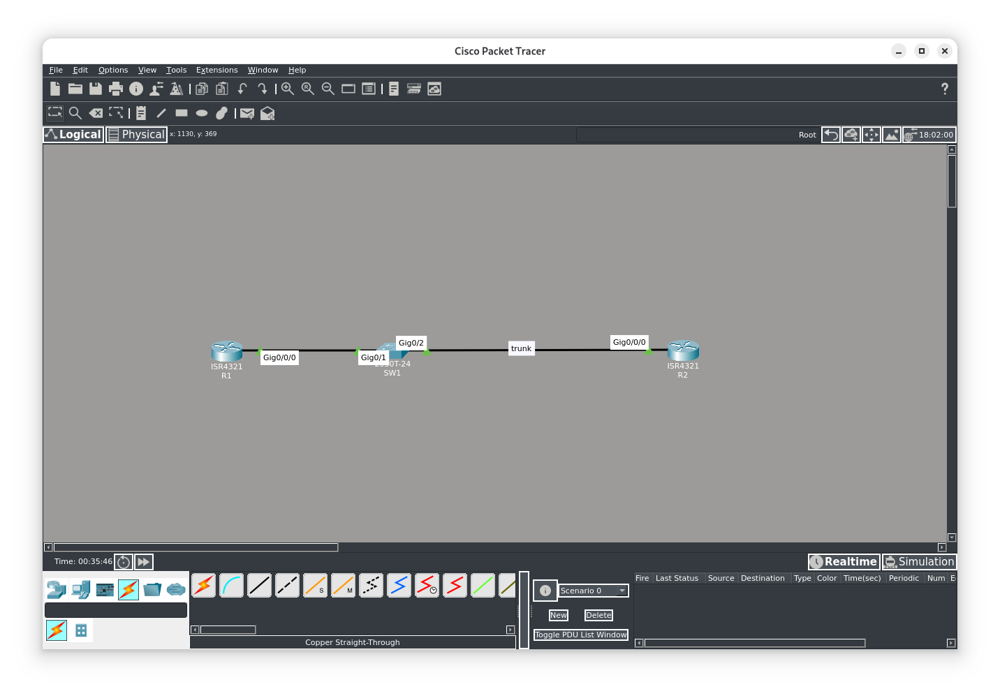
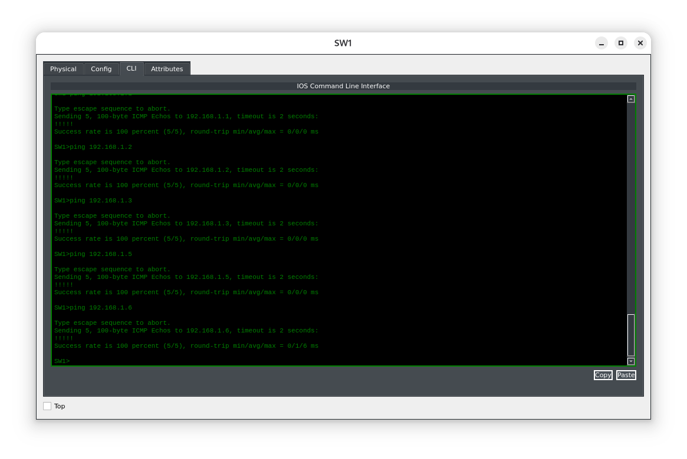

## Цель лабораторной работы

Цель этого лабораторного задания — настроить маршрутизаторы и коммутаторы так, чтобы они могли взаимодействовать с удалёнными сетями. По умолчанию устройства могут обмениваться данными только с локально подключёнными сетями. Шлюзы по умолчанию позволяют маршрутизаторам и коммутаторам взаимодействовать с удалёнными подсетями (быть доступными из них и обращаться к ним). 

**Задание 1**
Настройте имена хостов на коммутаторе SW1, маршрутизаторах R1 и R2 в соответствии с приведённой выше топологией.

**Задание 2**
Настройте коммутатор SW1 в качестве VTP‑сервера и создайте VLAN‑ы согласно приведённой выше схеме. Кроме того, настройте интерфейс GigabitEthernet0/2 на SW1 как транковый с инкапсуляцией 802.1Q. Убедитесь, что нужный интерфейс коммутатора назначен в VLAN 10.

**Задание 3**
Настройте IP‑адресацию на маршрутизаторах R1 и R2, а также на интерфейсе VLAN20 на коммутаторе SW1 согласно приведённой схеме. Кроме того:
- настройте на SW1 шлюз по умолчанию — 192.168.1.5;
- настройте на R1 маршрут по умолчанию через интерфейс GigabitEthernet0/0;
- сделайте VLAN20 native VLAN на маршрутизаторе;
- установите native VLAN на транковом порту коммутатора равным 20.

**Задание 4**
Проверьте конфигурацию, выполнив ping с коммутатора Sw1 на адрес интерфейса GigabitEthernet0/0 маршрутизатора R1 (192.168.1.1).

#### Топология

#### Задание 1:
Настройка имен:
```
Router>ena
Router#conf t
Enter configuration commands, one per line. End with CNTL/Z.
Router(config)#host R1
```
Настройка остальных устройств выполняется аналогично.
#### Задание 2:
По умолчанию VTP работает в каачестве сервера. Настроим интерфейс SW1 G0/1 в качестве транкового и определим VLANы.
```
SW1(config)#int g0/2
SW1(config-if)#switchport mode trunk
SW1(config-if)#switchport trunk allowed vlan all
SW1(config)#vlan 10
SW1(config-vlan)#name R1-VLAN
SW1(config-vlan)#exit
SW1(config)#vlan 20
SW1(config-vlan)#name R2-VLAN
SW1(config-vlan)#exit
%SYS-5-CONFIG_I: Configured from console by console
```
#### Задание 3:
Настроим IP‑адресацию на маршрутизаторах R1 и R2, а также на интерфейсе VLAN20 на коммутаторе Sw1 согласно топологии.
```
R1(config)#int g0/0/0
R1(config-if)#ip address 192.168.1.1 255.255.255.252
R1(config-if)#exit
R1(config)#ip route 0.0.0.0 0.0.0.0 g0/0/0
%Default route without gateway, if not a point-to-point interface, may impact performance

R2(config)#
R2(config)#int g0/0/0
R2(config-if)#description "CONN TO SW1 TRUNK G0/2"
R2(config-if)#no shut
R2(config-if)#exi
R2(config)#int g0/0/0.10
R2(config-subif)#description "SUBIF FOR VLAN 10"
R2(config-subif)#encapsulation dot1Q 10
R2(config-subif)#ip add 192.168.1.2 255.255.255.252
R2(config-subif)#exit
R2(config)#int g0/0/0.20
R2(config-subif)#
R2(config-subif)#description "SUBIF FOR VLAN 20 NATIVE"
R2(config-subif)#encapsulation dot1Q 20 native
R2(config-subif)#ip address 192.168.1.5 255.255.255.252
R2(config-subif)#^Z
%SYS-5-CONFIG_I: Configured from console by console

SW1(config)#int vlan 1
SW1(config-if)#shut
SW1(config-if)#exi
SW1(config)#int vlan 20
SW1(config-if)#ip add 192.168.1.6 255.255.255.252
SW1(config-if)#no shut
SW1(config-if)#exit
SW1(config)#int g0/2
SW1(config-if)#switchport trunk native vlan 20
SW1(config-if)#exi
SW1(config)#ip default-gateway 192.168.1.5
SW1(config)#^Z
```
#### Задание 4:
Проверим доступность устройств через шлюз по умолчанию.

**Конфигурация устройств:**

```
SW1#show running-config
Building configuration...
Current configuration : 1276 bytes
version 12.1
hostname SW1
.
.
.
interface GigabitEthernet0/1
	switchport access vlan 10
	switchport mode access
interface GigabitEthernet0/2
	switchport trunk native vlan 20
	switchport mode trunk
interface Vlan1
	no ip address
	shutdown
interface Vlan20
	ip address 192.168.1.6 255.255.255.252
	ip default-gateway 192.168.1.5
end


R2#show running-config
Building configuration...
Current configuration : 869 bytes
version 15.4
hostname R2
.
.
.
interface GigabitEthernet0/0/0
	description "CONN TO SW1 TRUNK G0/2"
	no ip address
	duplex auto
	speed auto
interface GigabitEthernet0/0/0.10
	description "SUBIF FOR VLAN 10"
	encapsulation dot1Q 10
	ip address 192.168.1.2 255.255.255.252
interface GigabitEthernet0/0/0.20
	description "SUBIF FOR VLAN 20 NATIVE"
	encapsulation dot1Q 20 native
	ip address 192.168.1.5 255.255.255.252
interface GigabitEthernet0/0/1
	no ip address
	duplex auto
	speed auto
	shutdown
interface Vlan1
	no ip address
	shutdown
end


R1#show running-config
Building configuration...
Current configuration : 623 bytes
version 15.4
hostname R1
.
.
.
interface GigabitEthernet0/0/0
	ip address 192.168.1.1 255.255.255.252
	duplex auto
	speed auto
interface GigabitEthernet0/0/1
	no ip address
	duplex auto
	speed auto
	shutdown
interface Vlan1
	no ip address
	shutdown
ip route 0.0.0.0 0.0.0.0 GigabitEthernet0/0/0
end
```

