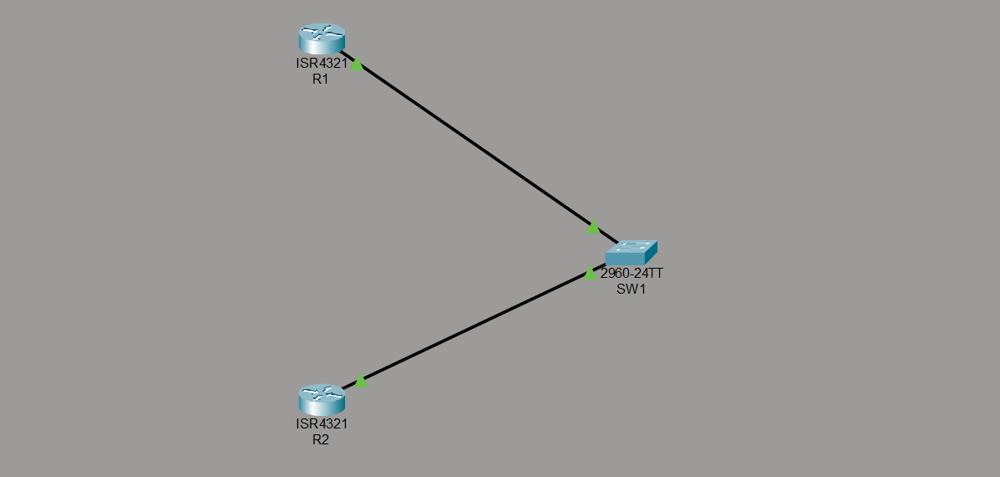
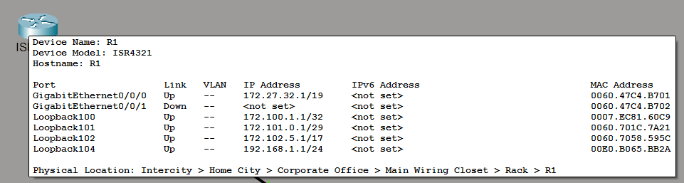
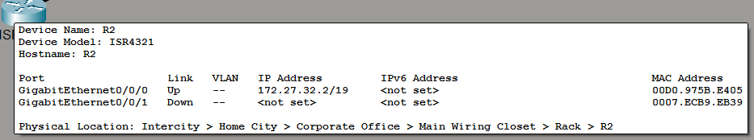

#### Lab Objective:

The objective of this lab exercise is to configure static routes via Ethernet interfaces connected to a switch on two routers. This lab also goes through the validation of the configured static routes.

#### Lab Purpose:

Static route configuration is a fundamental skill. There are several methods to configure static routes on a Cisco router, and each way has its pros and cons.

#### Lab Topology


#### IP Addressing
R1 Addressing

Here we created an additional loopback104 interface for checking ourself that packets can go correctly to the loopback 100-102 interfaces as we define in R2 static routes.

R2 Addressing


SW1 VLANs


#### Device running config
SW1
```
SW1#sh run
Building configuration...

hostname SW1

interface GigabitEthernet0/1
	switchport access vlan 10
	switchport mode access
interface GigabitEthernet0/2
	switchport access vlan 10
	switchport mode access
```

R1
```
R1#sh run
Building configuration...

hostname R1

interface Loopback100
	ip address 172.100.1.1 255.255.255.255
interface Loopback101
	ip address 172.101.0.1 255.255.255.248
interface Loopback102
	ip address 172.102.5.1 255.255.128.0
interface Loopback104
	ip address 192.168.1.1 255.255.255.0

interface GigabitEthernet0/0/0
	ip address 172.27.32.1 255.255.224.0
	duplex auto
	speed auto
```

R2
```
R2#sh run
Building configuration...

hostname R2

interface GigabitEthernet0/0/0
	ip address 172.27.32.2 255.255.224.0
	duplex auto
	speed auto

ip route 172.100.1.1 255.255.255.255 GigabitEthernet0/0/0
ip route 172.101.0.0 255.255.255.248 GigabitEthernet0/0/0
ip route 172.102.0.0 255.255.128.0 GigabitEthernet0/0/0
end
```