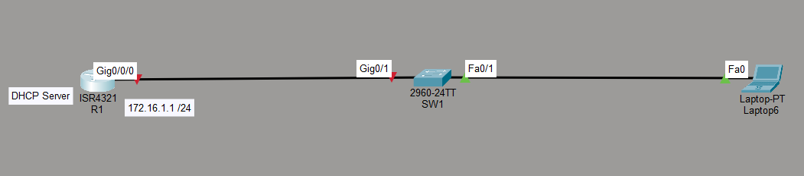
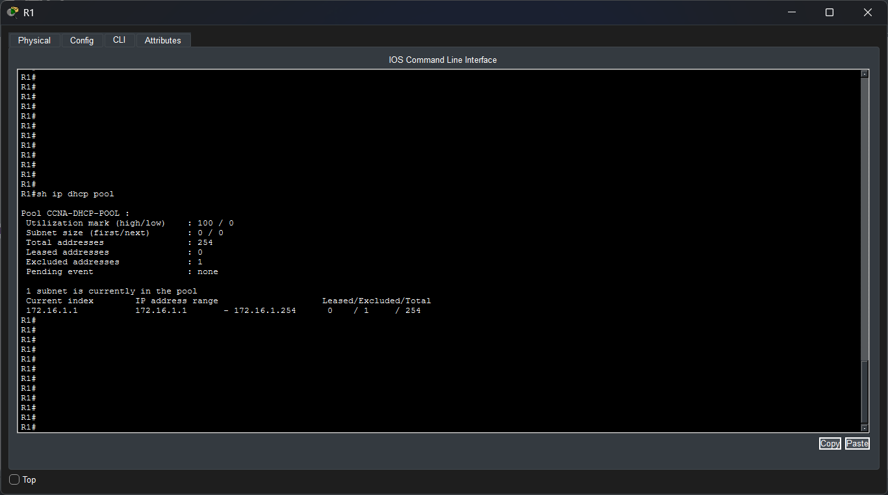
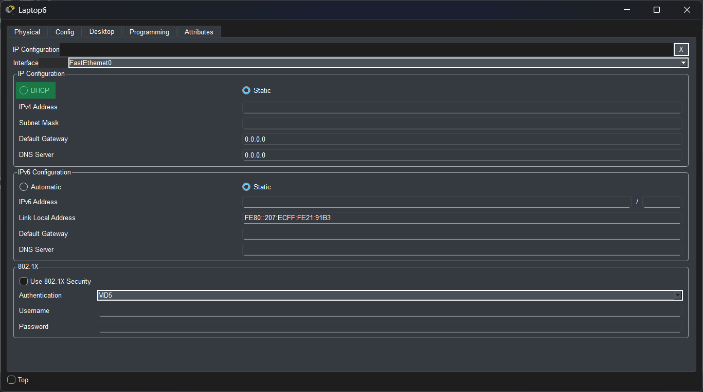
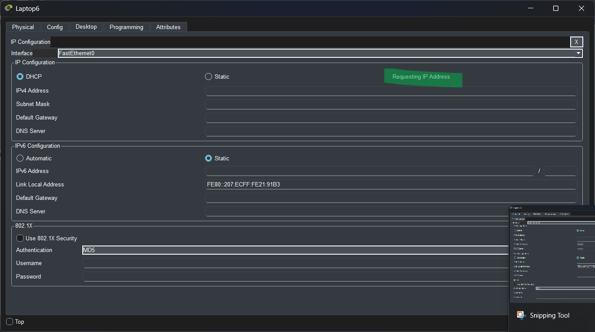
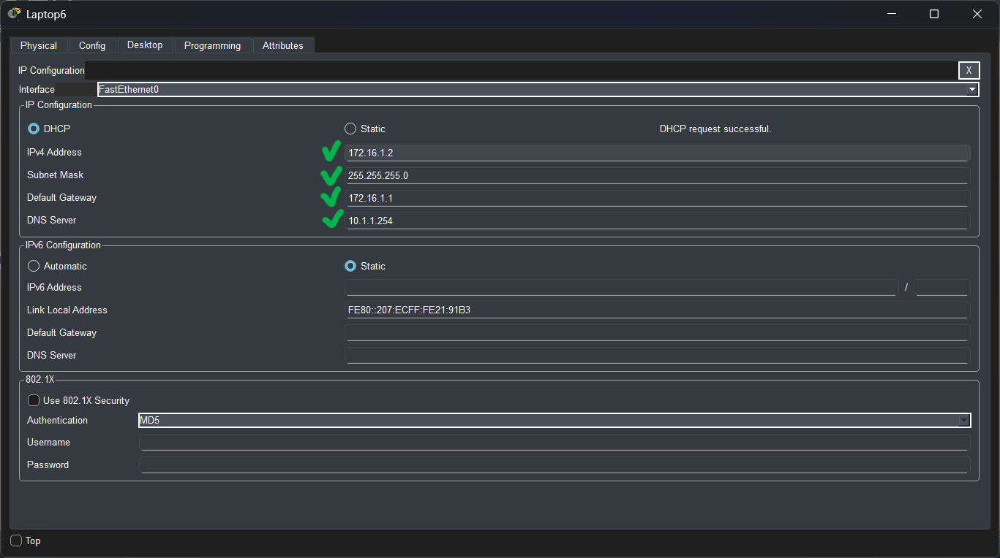

#### Lab Objective:

The objective of this lab exercise is for you to learn and understand how to configure the Cisco IOS DHCP server.

#### Lab Purpose:

Configuring the Cisco IOS DHCP server is a fundamental skill. DHCP (Dynamic Host Configuration Protocol) provides dynamic addressing information to hosts on a network. Typically, physical DHCP servers (such as Microsoft Windows servers) are used to provide addressing information to DHCP clients (which are devices that request configuration via DHCP). However, Cisco IOS routers can also be configured to act as DHCP servers and provide dynamic addressing to DHCP clients.

**IMPORTANT NOTE**: In order to test DHCP functionality, you will need a workstation DHCP client configured to receive IP addressing information via DHCP. If you do not have a DHCP client, feel free to substitute it with another Cisco IOS router configured as a DHCP client by using the ip address dhcp command on the interface connected to the DHCP router.

#### Lab Topology:
Please use the following topology to complete this lab exercise:


#### Task 1:
Configure the hostnames on R1 and Sw1 as illustrated in the topology.
That's easy, already done!
#### Task 2:
Configure VLAN50 named DHCP_VLAN on Sw1. Assign the FastEthernet0/2 and FastEthernet0/3 interfaces on Sw1 to this VLAN. Ensure that the ports immediately transition to the Spanning Tree Forwarding state. This is actually an ICND2 requirement but I’ve slipped it in here (we’ll do a PortFast lab in the ICND2 section).

```
Switch>enable
Switch#configure terminal
Enter configuration commands, one per line. End with CNTL/Z.
Switch(config)#hostname SW1
SW1(config)#vlan 50
SW1(config-vlan)#name DHCP_VLAN
SW1(config-vlan)#exit
SW1(config)#int vlan 50
SW1(config)#int g0/1
SW1(config-if)#switchport mode access
SW1(config-if)#switchport access vlan 50
SW1(config)#int f0/1
SW1(config-if)#switchport mode access
SW1(config-if)#switchport access vlan 50
```
#### Task 3:
Configure R1 as a Cisco IOS DHCP server with the following settings:

- DHCP pool name: CCNA-DHCP-POOL
- DHCP network: 172.16.1.0/24
- DNS server: 10.1.1.254
- WINS server: 10.2.2.254
- Default gateway: 172.16.1.1
- DNS domain: howtonetwork.net
- DHCP lease time: 5 days 30 minutes

```
Router>enable
Router#configure terminal
Enter configuration commands, one per line. End with CNTL/Z.
Router(config)#hostname R1
R1(config)#ip dhcp pool CCNA-DHCP-POOL
R1(dhcp-config)#network 172.16.1.0 255.255.255.0
R1(dhcp-config)#dns-server 10.1.1.254
R1(dhcp-config)#default-router 172.16.1.1
R1(dhcp-config)#domain-name howtonetwork.net
R1(config)#ip dhcp excluded-address 172.16.1.1
R1(config)#exit
```

Some of the options above are not available in Packet Tracer, so you may want to use GNS3.
Ensure that you exclude the IP address of the router interface from the DHCP pool.
#### Task 4:
Verify your DHCP configuration on the connected workstation (or other DHCP client) and verify that your Cisco IOS DHCP server is showing a leased DHCP address.


Let's turn up our PC and configure to achieve IP address by DHCP.






Our service is working correctly! If any trouble are detected try Simulation mode and see a packets detail or each step detail!
