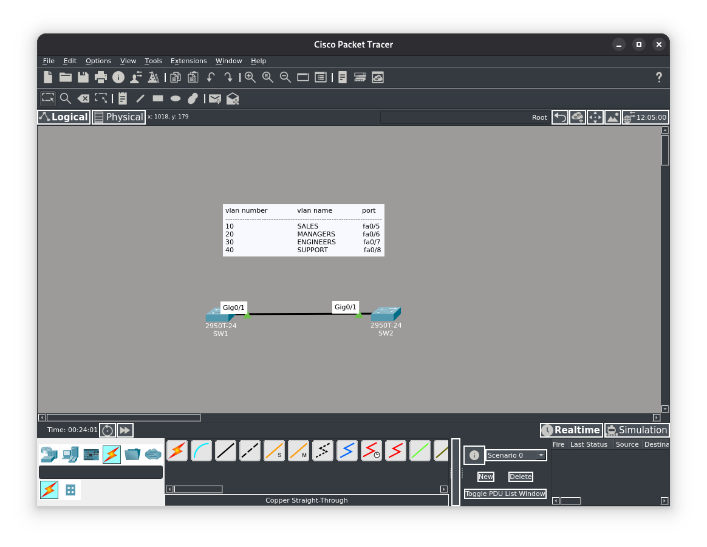
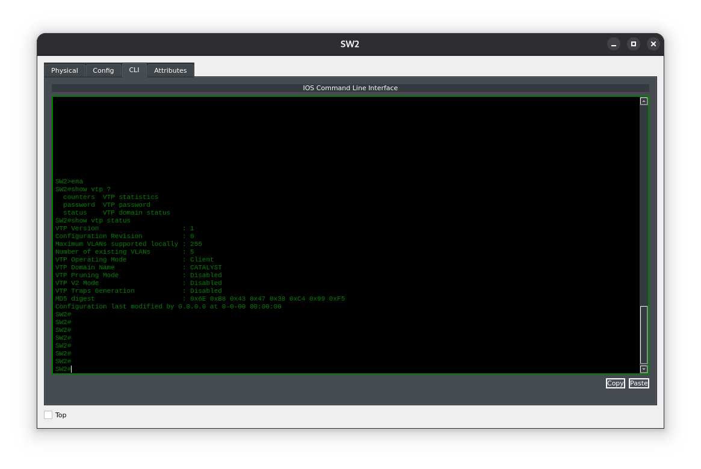

**Цель лабораторной работы:**
Цель этого лабораторного упражнения — научиться и понять, как защищать домены VTP с помощью коммутаторов Cisco Catalyst. По умолчанию домены VTP не защищены паролем.

**Назначение лабораторной работы:**
Защита подключения. Если домен VTP не защищён паролем, в сеть можно подключить неавторизованные («злоумышленные») коммутаторы — и это может нарушить работу сервисов.

#### Топология


---

**Задание 1:**
В рамках подготовки к настройке VLAN задайте имена хостов для коммутаторов SW1 и SW2 в соответствии с приведённой топологией.

**Задание 2:**
Настройте и проверьте, что коммутатор SW1 работает в режиме VTP‑сервера, а коммутатор SW2 — в режиме VTP‑клиента. Оба коммутатора должны находиться в домене VTP с именем CATALYST. Защитите сообщения VTP с помощью пароля vtppa55w0rD.

**Задание 3:**
Настройте и проверьте транковое соединение (802.1Q trunk) на интерфейсе GigabitEthernet0/1 между коммутаторами SW1 и SW2.

**Задание 4:**
Настройте и проверьте VLAN с 10 по 40 на коммутаторе SW1 с указанными выше именами. Убедитесь, что эти VLAN по‑прежнему распространяются на коммутатор SW2 после того, как VTP был защищён паролем.

#### Задание 1:
Зададим имена устройств в соответствии с заданием
```
Switch>ena
Switch#conf t
Enter configuration commands, one per line. End with CNTL/Z.
Switch(config)#hostname SW1
SW1(config)#
```
Настройка SW2 выполняется идентично и не приведена здесь.
#### Задание 2:
Сконфигурируем на SW1 и SW2 в нужные режимы. на данном этапе на SW1 нужно настроить только домен VTP, т.к. по заданию у нас SW1 это сервер, а он настроен по умолчанию на Cisco Catalyst.
```
SW1(config)#vtp domain CATALYST
Changing VTP domain name from NULL to CATALYST
SW1(config)#%SW_VLAN-6-VTP_DOMAIN_NAME_CHG: VTP domain name changed to CATALYST.
SW1(config)#vtp password pa55w0rD

SW2(config)#vtp mode client
Setting device to VTP CLIENT mode.
SW2(config)#vtp domain CATALYST
Changing VTP domain name from NULL to CATALYST
SW2(config)#%SW_VLAN-6-VTP_DOMAIN_NAME_CHG: VTP domain name changed to CATALYST.
SW2(config)#vtp password pa55w0rD
```

#### Задание 3:
Настроим порт GigabitEthernet0/1 в качестве транкового.
```
SW1(config)#int g0/1
SW1(config-if)#switchport mode trunk
%LINEPROTO-5-UPDOWN: Line protocol on Interface GigabitEthernet0/1, changed state to down
%LINEPROTO-5-UPDOWN: Line protocol on Interface GigabitEthernet0/1, changed state to up
SW1(config-if)#switchport trunk allowed vlan 10,20,30,40
```
На устройстве SW2 настройка проводится аналогично.
#### Задание 4:
Зададим access VLANы согласно заданию.
```
SW1(config)#vlan 10
SW1(config-vlan)#name SALES
SW1(config-vlan)#exit
SW1(config)#vlan 20
SW1(config-vlan)#name MANAGERS
SW1(config-vlan)#exit
SW1(config)#vlan 30
SW1(config-vlan)#name ENGINEERS
SW1(config-vlan)#exit
SW1(config)#vlan 40
SW1(config-vlan)#name SUPPORT
SW1(config-vlan)#exit
SW1(config)#int fa0/5
SW1(config-if)#switchport mode access
SW1(config-if)#switchport access vlan 10
SW1(config-if)#exit
SW1(config)#int fa0/6
SW1(config-if)#switchport mode access
SW1(config-if)#switchport access vlan 20
SW1(config-if)#exit
SW1(config)#int fa0/7
SW1(config-if)#switchport mode access
SW1(config-if)#switchport access vlan 30
SW1(config-if)#exit
SW1(config)#int fa0/8
SW1(config-if)#switchport mode access
SW1(config-if)#switchport access vlan 40
SW1(config-if)#exit
SW1(config)#
```
Настройка SW2 проводится аналогичным образом.

Чтобы убедится что устройства синхронизированны и защищены проверим их криптографическую хеш‑функцию MD5, они должны совпадать.
Видим что это так.


> MD5-SW1: **0xF0 0x52 0x2F 0xC2 0xC0 0x17 0x25 0x45**
> MD5-SW2: **0xF0 0x52 0x2F 0xC2 0xC0 0x17 0x25 0x45**

