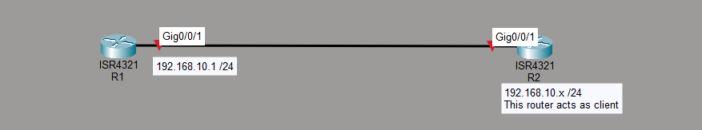
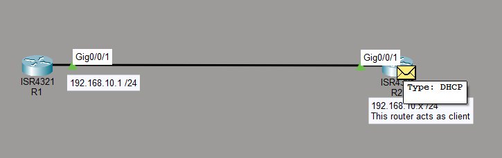
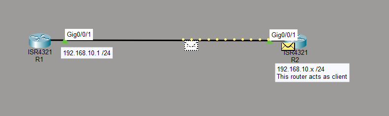
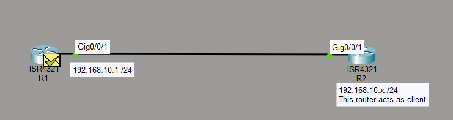
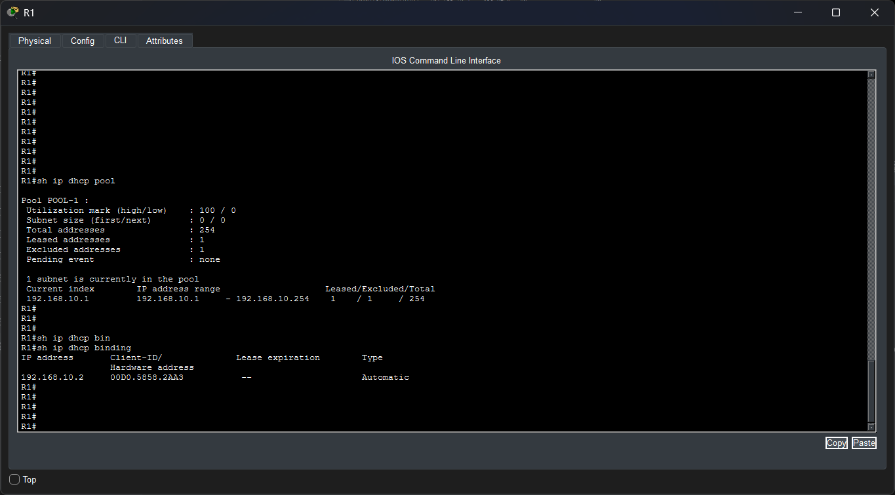
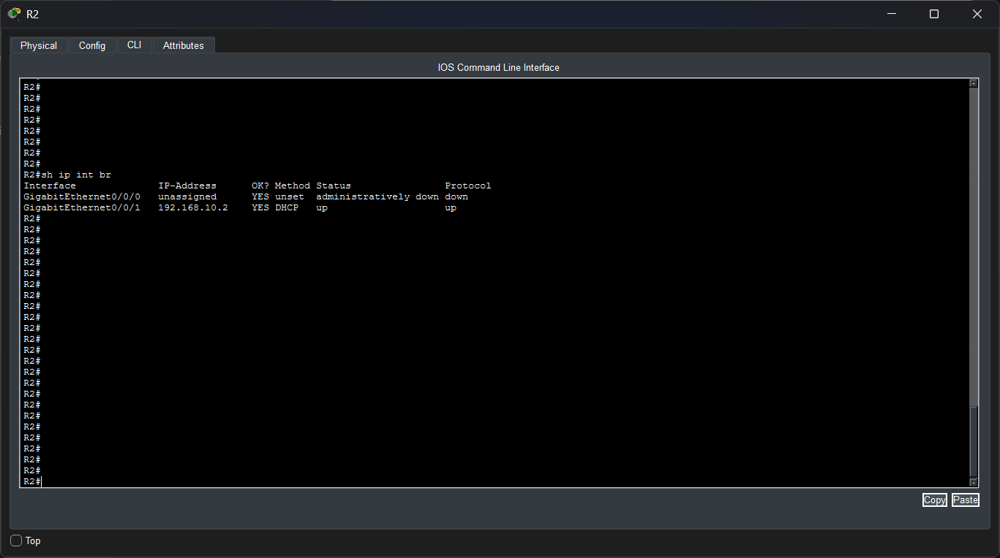
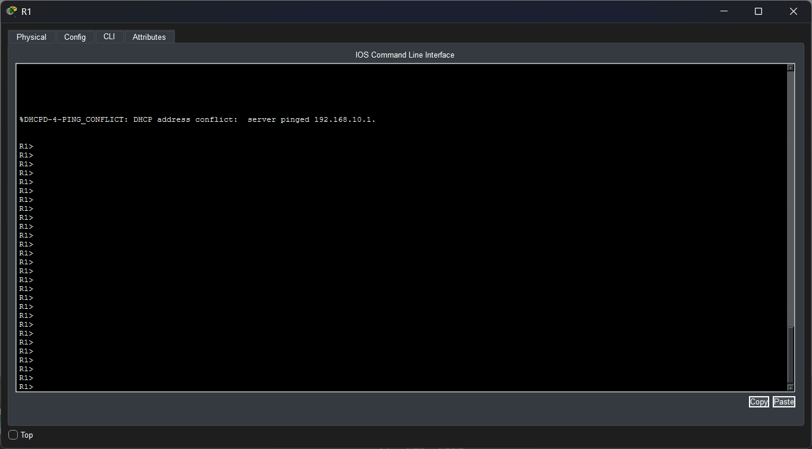
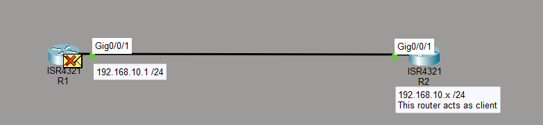
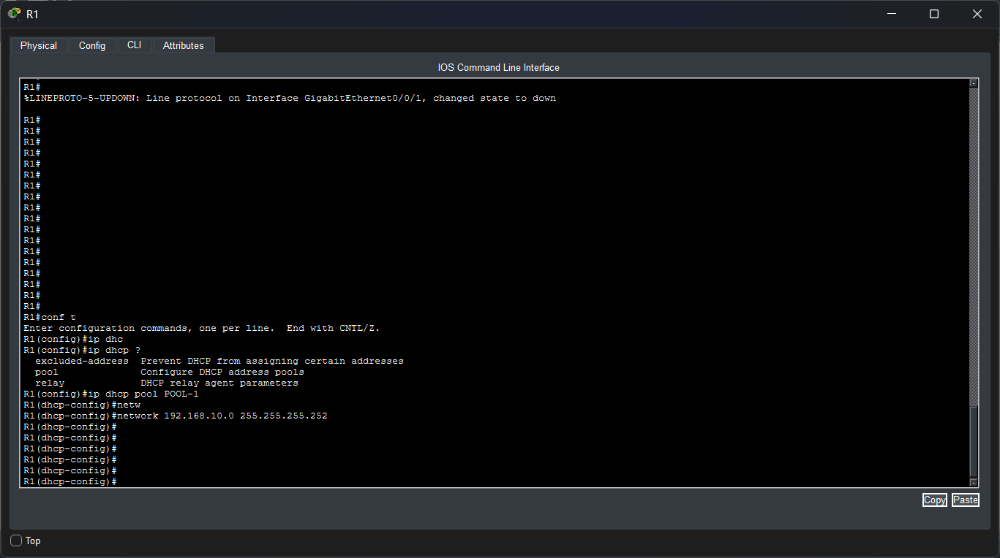
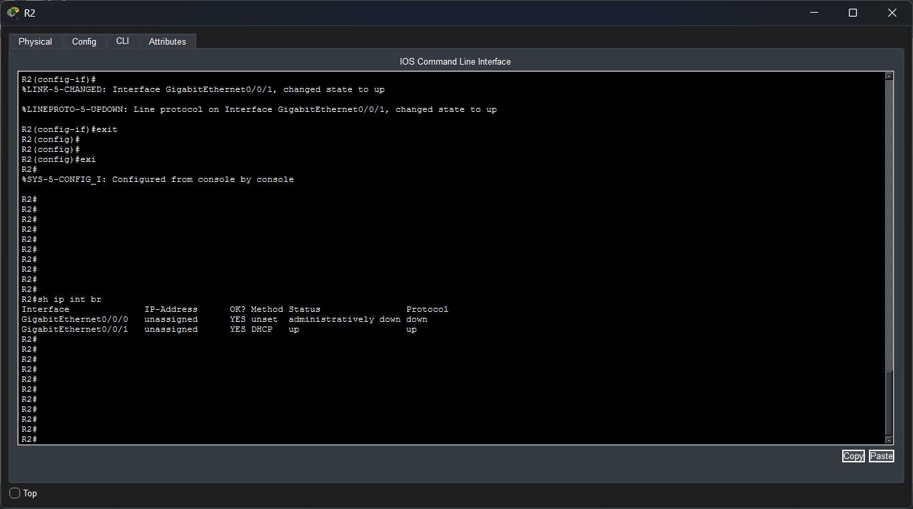

#### Lab Objective:
The objective of this lab exercise is for you to learn how to implement DHCP in a Cisco router both as a DHCP server and a DHCP client.
#### Lab Purpose:
Configuring DHCP is a very important task for every network engineer, as this protocol is in charge of the assignment of IP addresses. In this lab, you will learn the steps required to both provide and learn an IP address via DHCP.
#### Lab Topology:
Please use the following topology to complete this lab exercise:

#### Task 1:
Configure the hostnames on R1 and R2 as illustrated in the topology.
That's easy, already done!
#### Task 2:
Configure the IP addresses on the Gig0/0 interface of R1 as illustrated in the topology.
**Note**: R2 will obtain the IP of its Gigabit interface via DHCP.
```
Router>enable
Router#configure terminal
Enter configuration commands, one per line. End with CNTL/Z.
Router(config)#hostname R1
R1(config)#int g0/0/1
R1(config-if)#ip add 192.168.10.1 255.255.255.0
```
#### Task 3:
Configure a DHCP pool on R1 to provide an IP address to the different devices connected on its interface Gig0/0 with the following settings:
- DHCP pool name: Pool-1
- DHCP subnet: 192.168.10.0/24
- DHCP DNS server: 4.2.2.2
- DHCP default gateway: 192.168.10.1
**Note**: Make sure you exclude the 192.168.10.1 address from the DHCP pool.
```
R1(config-if)#exit
R1(config)#ip dhcp pool POOL-1
R1(dhcp-config)#network 192.168.10.0 255.255.255.0
R1(dhcp-config)#dns-server 4.2.2.2
R1(dhcp-config)#default-router 192.168.10.1
R1(dhcp-config)#ex
R1(config)#ip dhcp excluded-address 192.168.10.1
R1(config)#
```
#### Task 4:
Configure R2 interface Gig0/0 to obtain its IP address via DHCP.
```
R2>en
R2#conf t
R2(config)#int g0/0/1
R2(config-if)#ip add dhcp
R2(config-if)#no shutdown
```





#### Task 5:
Confirm the assignment of the IP address on both the DHCP client and DHCP server running the following commands:
On the DHCP server:
- show ip dhcp pool (to check the DHCP configuration)
- show ip dhcp binding (to check the database of IPs provided and the clients that have obtained each of those IPs)

On the DHCP client:
- show ip interface brief (to confirm that it gets an IP and it’s obtained via DHCP).

#### Task 6:
Now break the lab in a few ways. Start from the beginning (reload the routers):
- Don’t exclude the IP address.

- Configure the wrong network range. (Didn't accept DHCP Discover)

- Configure the correct network range but with the subnet of 255.255.255.252 (so you only have two host addresses).



